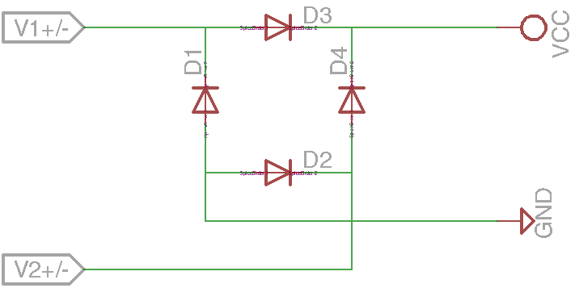

# Basic circuits

A collection of simple and basic circuits.

<t style="color: red">WARNING!!</t> This repo is a collection of note and tests, is not always trusted.

###### Base circuits

 - [Resistors Circuit](#resistors-circuit)
 - [LED Circuit](#led-circuit)
 - [Capacitors Circuit](#capacitors-circuit)
 - [Button Circuit](#button-circuit)
 - [LED Indicator Circuit](#led-indicator-circuit)

###### Utilities circuits

 - [Power Circuit](#power-circuit)
 - [Switch Circuit](#switch-circuit)
 - [Digital Logic Circuits](#digital-logic-circuits)
 - [H-Bridge Circuits](#h-bridge-circuit)
 - [Diode Bridge Circuit](#diode-bridge-circuit)
 - [Pull-up/pull-down Resistor Circuit](#pull-uppull-down-resistor-circuit)
 - [Level up/down Circuit (Amplifier)](#level-updown-circuit-amplifier)

###### Advanced circuits

 - [RS232 to Serial Circuit](#rs232-to-serial-circuit)
 - [USB to Serial Circuit](#usb-to-serial-circuit)
 - [Basic Stamp 2](bs2/README.md)
 - [Arduino](arduino/README.md)
 - [Devices UART](uart/README.md)

###### Other

 - [Links](#links)

## Resistors Circuit

###### Resistor in parallel:

**Rtot = 1 / (1/R1 + 1/R2 + 1/R3 ... + 1/Rn)**

###### Resistor in series:

**Rtot = R1 + R2 + R3 ... + Rn**

###### First Ohms law:
**I = V/R** or **V = RI** or **R = V/I**

###### Ex.:

 - *R1 = 110ohm*
 - *R2 = 330ohm*
 - *R3 = 220ohm*
 - *Vcc = 12V*

The total resistance of the circuit is **Rtot = R1 + R2-3 = 110 + 132 = 242ohm** where **R2-3 = 1 / (1/R1 + 1/R2) = 1 / (1/330 + 1/220) = 132ohm**

The current on the circuit is **I = V / Rtot = 12 / 242 = 0.05A = 50mA**

The voltage between *A* and *B* is **VA-B = R1 \* I = 110 \* 0.05 = 5.5V**

The voltage between *B* and *C* is **VB-C = R2-3 \* I = 132 \* 0.05 = 6.6V**

So, **V = VA-B + VB-C = 5.5 + 6.6 = 12.1V**

### Resistors Color Code

The colored bands over the resistors indicate their resistance, using this table you can find the value:

## LED Circuit

Is the smallest circut used to power a LED (Light Emitting Diode)

The *R1* resistor depends on the *Vcc* voltage and on the LED type. For e *3mm LED* at *5 VDC*, for example, this are the rounded values:

Size | Color  | Forward current | Foward voltage | Resistor 
---- | ------ | --------------- | -------------- | --------
3mm  | Red    | 20mA            | 1.8 VDC        | 160 ohm
3mm  | Green  | 20mA            | 2.2 VDC        | 140 ohm
3mm  | Yellow | 20mA            | 2.1 VDC        | 145 ohm
3mm  | Blue   | 20mA            | 2.8 VDC        | 110 ohm

In general, the formul is:

 **R = (Vcc - VL) / IL**

### Links

 - [Eagle project](led/)
 - [LED Resistor Calculator](http://www.ohmslawcalculator.com/led-resistor-calculator)

## Capacitors Circuit

### Code

The code over the capacitors indicate their capacitance, using this table you can find the value:

 1st 2nd number | 3rd number | Multiply with 
----------------|------------|---------------
 xx  | 0 | 1
 xx  | 1 | 10
 xx  | 2 | 100
 xx  | 3 | 1,000
 xx  | 4 | 10,000
 xx  | 5 | 100,000
 xx  | 6 | 1,000,000
 xx  | 7 | Not used
 xx  | 8 | 0.01
 xx  | 9 | 0.1
 xRx | / | 0.1

In general, the first two digit are the value, the 3rd is the multiplier and the letter is for tollerance. The very small capacitors can have an **R** between the first and second digits, this means that there is a point (ex. *2R2 = 2.2pF*).

In other case, the value wrote above capacitor is in micro-farad (es. **.33**) or with specified multiplier (es. **330n**).

 Value | Type 1 |  Type 2 |  Type 3 
-------|--------|---------|---------
 100nF | 101 | 100n | .1
 120nF | 124 | 120n | .12
 150nF | 154 | 150n | .15

If there is a uppercase letter after the code, it represents the tollerance (ex. **.33K**):

 Letter | Tolerance
--------|----------
 D | 0.5pF
 F | 1%
 G | 2%
 H | 3%
 J | 5%
 K | 10%
 M | 20%
 P | +100% / -0%
 Z | +80% / -20%
 
If there is a number after the tollerance, it represents the voltage (ex. **.33K63**).

Normally, on the electrolytic capacitors, there are the capacitance and the max voltage wrote in the clear form.

#### TODO

 - parallel and series
 - bypass and decoupling
 - charge
 - discarge
 - oscilloscope
 - RC and filters

### Links
 - [Eagle project](capacitors/)
 

## Button Circuit

#### TODO

 - oscilloscope

## LED Indicator Circuit

This is a example that allow you to indicate the locical value in a line.

*LED1* indicate the **1** logic state, *LED2* indicate the **0** logic state.

This is possible because a LED is a diode, so it allow the current flow only from positive to negative. When the line is at Vcc, *LED1* allow current flow so it's on and *LED2* is off. Vice versa, when the line is at GND, *LED2* don't allow current flow so it's off and *LED2* is on.

### Links
 - [Eagle project](led_indicator/)

## Power Circuit

The standard **voltage regulator** is a component that allow us to get a normalized current and voltage. Every voltage regulator have a specific max Vin level and in order to get clean power, the datasheets recommends to using a **capacitor**.

In this circuit I added a **12V diode** in order to perform a simple reverse polarity and overvoltage protection.

### Links
 - [Diode Bridge Circuit](power/)

## Switch Circuit

A good utilities in the electronics experiments is the switch, that allow us to pilot a device.

The first version of switch is called *low-side switch* because the transistor are in the low side of the circuit. The second one is called *high-side switch* for the same reson.

The switch can be used for pilot higher voltage devices (according to the transistor specification) like a *motor*.

### Transistors

The transistor is a semiconductor device very used in eletronic. They have two base use case:

 - interrupt a signal (switch)
 - aplifing a signal

#### Types

There are many transistor type that have different caratteristic:

 - *Bipolar junction transistor* (**BJT**), most used in analog circuits because of their greater linearity and ease of manufacture
 - *Field-effect transistor* (**FET**), most used in digital circuit

All the type can be *P-channel* (**PNP**) or *N-channel* (**NPN**).

Transistor have *3* pad called *emitter* (**E**), *base* (**B**) and *collector* (**C**).

On the **NPN** transistor (in the simbol arrow Not Point iN :-) ) the main current flows from **C** (*+*) to **E** (*-*) and the controlling current flows from **B** (*+*) to **E** (*-*).

Conversely, on the **PNP** transistor (in the simbol arrow Point In) the main current flows from **E** (*-*) to **C** (*+*) and the controlling current flows from **E** (*-*) to **B** (*+*).

**IE = IB + IC**

Is good to remember that the real electron flow is opposit of theoretical current flow.

### Links

 - [Sparkfun guide](https://learn.sparkfun.com/tutorials/transistors)

## Digital Logic Circuits

Another interesting use of the transistors is to do a digital logic operation.

The first schema represent a **NOT** gate, if *A* is at *VCC* the output is at *GND* and vice-versa.

The second schema represent a 2-input **AND** gate, if *A* and *B* are at *VCC* the output is at *VCC*, *GND* otherwise.

The last one represent a 2-input **OR** gate, if *A* or *B* are at *VCC* the output is at *VCC*, *GND* otherwise.

### Links

 - [Sparkfun guide](https://learn.sparkfun.com/tutorials/transistors)

## H-Bridge Circuit

In orther to pilot a DC motor an H-bridge is required.

The *H-Bridge* take his name from the form of his schema.

If *INA* and and *INB* are both at the same voltage, *OUTA* and *OUTB* will be at the same voltage, so the motor won’t be able to spin.

 Input A | Input B | Output A | Output B | Motor Direction
---------|---------|----------|----------|-----------------
0 | 0 | 1 | 1 | Stopped (braking)
0 | 1 | 1 | 0 | Clockwise
1 | 0 | 0 | 1 | Counter-clockwise
1 | 1 | 0 | 0 | Stopped (braking)

A well designed H-bridge must to be more complex.

Usually, a *IC* (es. **L293**) is used instead a homemade H-bridge.

### Links

 - [Sparkfun guide](https://learn.sparkfun.com/tutorials/transistors) 

## Diode Bridge Circuit

###### Zener Diode

A **Diode Bridge** is a circuit that provides the same polarity of output for either polarity of input and it's made by **4 diode**.

If the *V1* supply is positive, current flows through *D3* to Vcc and flows to *V2* through *D2*. Vice versa, if the *V1* supply is negative, current flows through *D4* to Vcc and flows to *V1* through *D1*.

The Diode Bridge is good to correct **Power Circuit** inverted polarity, but it allow us to convert an **AC** input into a **DC** output, for this porpuse, the addition of a capacitor is recomanded in order to prevent an output of pulsed DC.

### Links
 - [Diode Bridge Circuit](diode_bridge/)

## Pull-up/pull-down Resistor Circuit

#### TODO

## Level up/down Circuit (Amplifier)

#### TODO

### Links

 - [Sparkfun guide](https://learn.sparkfun.com/tutorials/transistors)

## Oscillator Circuit

####TODO

### Links

 - [Sparkfun guide](https://learn.sparkfun.com/tutorials/transistors)
 - [Shift Oscillator](http://www.circuitstoday.com/transistor-phase-shift-oscillator)

## RS232 to Serial Circuit

### With MAX232

### With transistors

### Links
 - [RS232_to_serial](RS232_to_serial/)
 - [Adrirobot](http://www.adrirobot.it/menu_new/index/index_parallax.htm)

## USB to Serial Circuit

#### TODO

## Links

- [LED Matrix display](http://www.instructables.com/id/Arduino-LED-Scrolling-Text-Simple-Easy/step3/Testing/)
- [The Master's notes](http://electronics-notes.readthedocs.org/en/latest/)
- [BusPirate Python Oscilloscope](http://dangerousprototypes.com/docs/Bus_Pirate:_Python_Oscilloscope)
- [Seeed Studio PCB Service](http://www.seeedstudio.com/service/index.php?r=pcb)
- [Low Cost Components](www.aliexpress.com/category/502/electronic-components-supplies.html)
- [Adrirobot](http://www.adrirobot.it/)
