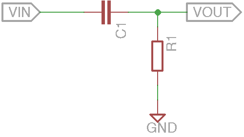

# Basic circuits

A collection of simple and basic circuits.

<t style="color: red">WARNING!!</t> This repo is a collection of note and tests, is not always trusted.

###### Base circuits

 - [Resistors Circuits](#resistors-circuits)
 - [LED Circuits](#led-circuits)
 - [Capacitors Circuits](#capacitors-circuits)

###### Utilities circuits

 - [Voltage Divider Circuit](#voltage-divider-circuit)
 - [LED Indicator Circuit](#led-indicator-circuit)
 - [RC Circuits](#rc-circuits)
 - [Coupling and Decoupling](#coupling-and-decoupling)
 - [Power Circuit](#power-circuit)
 - [Switch Circuit](#switch-circuit)
 - [Digital Logic Circuits](#digital-logic-circuits)
 - [H-Bridge Circuits](#h-bridge-circuit)
 - [Diode Bridge Circuit](#diode-bridge-circuit)
 - [Pull-up/pull-down Resistor Circuits](#pull-uppull-down-resistor-circuits)
 - [Debouncing Circuit](#debouncing-circuit)
 - [Level up/down Circuit (Amplifier)](#level-updown-circuit-amplifier)

###### Advanced circuits

 - [RS232 to Serial Circuit](#rs232-to-serial-circuit)
 - [USB to Serial Circuit](#usb-to-serial-circuit)
 - [Basic Stamp 2](bs2/README.md)
 - [Arduino](arduino/README.md)
 - [Devices UART](uart/README.md)

###### Tools

 - [BS-06 Bluetooth Module](#bs-06-bluetooth-module)

###### Other

 - [Links](#links)

## Resistors Circuits

###### Resistor in parallel:

**Rtot = 1 / (1/R1 + 1/R2 + 1/R3 ... + 1/Rn)**

###### Resistor in series:

**Rtot = R1 + R2 + R3 ... + Rn**

###### First Ohms law:
**I = V/R** or **V = RI** or **R = V/I**

###### Ex.:

 - *R1 = 110ohm*
 - *R2 = 330ohm*
 - *R3 = 220ohm*
 - *Vcc = 12V*

The total resistance of the circuit is **Rtot = R1 + R2-3 = 110 + 132 = 242ohm** where **R2-3 = 1 / (1/R1 + 1/R2) = 1 / (1/330 + 1/220) = 132ohm**

The current on the circuit is **I = V / Rtot = 12 / 242 = 0.05A = 50mA**

The voltage between *A* and *B* is **VA-B = R1 \* I = 110 \* 0.05 = 5.5V**

The voltage between *B* and *C* is **VB-C = R2-3 \* I = 132 \* 0.05 = 6.6V**

So, **V = VA-B + VB-C = 5.5 + 6.6 = 12.1V**

### Resistors Color Code

The colored bands over the resistors indicate their resistance, using this table you can find the value:

## LED Circuits

Is the smallest circut used to power a LED (Light Emitting Diode)

The *R1* resistor depends on the *Vcc* voltage and on the LED type. For e *3mm LED* at *5 VDC*, for example, this are the rounded values:

Size | Color  | Forward current | Foward voltage | Resistor 
---- | ------ | --------------- | -------------- | --------
3mm  | Red    | 20mA            | 1.8 VDC        | 160 ohm
3mm  | Green  | 20mA            | 2.2 VDC        | 140 ohm
3mm  | Yellow | 20mA            | 2.1 VDC        | 145 ohm
3mm  | Blue   | 20mA            | 2.8 VDC        | 110 ohm

In general, the formul is:

 **R = (Vcc - VL) / IL**

### Links

 - [Eagle project](led/)
 - [LED Resistor Calculator](http://www.ohmslawcalculator.com/led-resistor-calculator)

## Capacitors Circuits

###### Capacitance

**Q = CV** o **V = Q/C** o **C = Q/V**

###### Capacitors in parallel:

**Ctot = C1 + C2 + C3 ... + Cn**

###### Capacitors in series:

**Ctot = 1 / (1/C1 + 1/C2 + 1/C3 ... + 1/Cn)**

**Vi = Q/Ci**

###### Ex.:

 - *C1 = 10nF*
 - *C2 = 50nF*
 - *C3 = 20nF*
 - *Vcc = 12V*

The total capacitance of the circuit is **Ctot = 1 / (1/C1 + 1/C2-3) = 1 / (1/10 + 1/70) = 8.75nF** where **C2-3 = C1 + C2 = 50 + 20 = 70nF**

The total electric charge is **Qtot = Ctot * Vcc = 8.75\*10-9 * 12 = 105nQ**

The voltage between *A* and *B* is **VA-B = Q / C1 = 105 / 10 = 10.5V**

The voltage between *B* and *C* is **VB-C = Q / C2-3 = 105 / 70 = 1.5V**

So, **V = VA-B + VB-C = 10.5 + 1.5 = 12.1V**

##### LED Circuit

This is a simple circuit with a capacitor:

When we push the button, the current flows in the circuit and the LED lights up; this current also flow in the capacitor and charge his plates. When we release the button, the current stop to flows from power supply but flows out of the capacitor, so the LED still lights until the capacitor will discharged.

### Capacitors Code

The code over the capacitors indicate their capacitance, using this table you can find the value:

 1st 2nd number | 3rd number | Multiply with 
----------------|------------|---------------
 xx  | 0 | 1
 xx  | 1 | 10
 xx  | 2 | 100
 xx  | 3 | 1,000
 xx  | 4 | 10,000
 xx  | 5 | 100,000
 xx  | 6 | 1,000,000
 xx  | 7 | Not used
 xx  | 8 | 0.01
 xx  | 9 | 0.1
 xRx | / | 0.1

In general, the first two digit are the value, the 3rd is the multiplier and the letter is for tollerance. The very small capacitors can have an **R** between the first and second digits, this means that there is a point (ex. *2R2 = 2.2pF*).

In other case, the value wrote above capacitor is in micro-farad (es. **.33**) or with specified multiplier (es. **330n**).

 Value | Type 1 |  Type 2 |  Type 3 
-------|--------|---------|---------
 100nF | 101 | 100n | .1
 120nF | 124 | 120n | .12
 150nF | 154 | 150n | .15

If there is a uppercase letter after the code, it represents the tollerance (ex. **.33K**):

 Letter | Tolerance
--------|----------
 D | 0.5pF
 F | 1%
 G | 2%
 H | 3%
 J | 5%
 K | 10%
 M | 20%
 P | +100% / -0%
 Z | +80% / -20%
 
If there is a number after the tollerance, it represents the voltage (ex. **.33K63**).

Normally, on the electrolytic capacitors, there are the capacitance and the max voltage wrote in the clear form.

### Links
 - [Eagle project](capacitors/)

## Voltage Divider Circuit

Is possible to made a simple voltage divider using two resistance:

**Vout = (R2 / (R1 + R2)) * Vin**

With a *voltage divider*, a certain amount of current is wasted; with biggest resistors we get smallest consumption.

###### Ex.:

 - *R1 = 110ohm*
 - *R2 = 330ohm*
 - *Vcc = 12V*

**Vout = (R2 / (R1 + R2)) * Vin = (330 / (110 + 330)) * 12 = 9V**

### Links
 - [Eagle project](voltage_divider/)

## LED Indicator Circuit

This is a example that allow you to indicate the locical value in a line.

*LED1* indicate the **1** logic state, *LED2* indicate the **0** logic state.

This is possible because a LED is a diode, so it allow the current flow only from positive to negative. When the line is at Vcc, *LED1* allow current flow so it's on and *LED2* is off. Vice versa, when the line is at GND, *LED2* don't allow current flow so it's off and *LED2* is on.

### Links
 - [Eagle project](led_indicator/)

## RC Circuits

An RC circuit is made by a resistor and a capacitor.

This is the simplest RC circuit. When we push the button, the capacitor will charge.

When we release the button, the circuit is short-circuited and the capacitor will discharge.

The total charging/discharged times is **T = R * C** (ex. *4.5kΩ \* 1000uF = 4,7s*).

### Filters

The RC circuits can be used to filter a signal in frequncy. The cutoff frequency can be determined by the time constant:

**fc = 1 / (2πRC)**

###### Ex.:

 - *C1 = 10nF*
 - *R1 = 220ohm*

The cutoff frequency is **fc = 1 / (2πRC) = 1 / (2π * 1000 * 10\*10-9) = 15.91kHz**.

###### Passive Low-pass filter

A low-pass filter is a filter that cut the frequencies higher than the cutoff frequency.

###### Passive High-pass filter

A high-pass filter is a filter that cut the frequencies lower than the cutoff frequency.

### Links
 - [Eagle projects](rc_circuits/)

## Coupling and Decoupling

In electronic, the capacitors are very used for their property of blocking constant currents and let passing the variable currents.

A **decoupling** capacitor (also called **bypass** capacitor) is used for join two part of the circuit far and prevent variation of the voltage (nois). When there is an high peak of curren, the capacitor absorb it; vice-versa, when there is an low peak of curren, the capacitor release the electric charge. A decoupling capacitor is usually placed near of the *IC*'s power pins.

A **coupling** capacitor (also called **DC-blocking** capacitor) is used for separate two part of circuit and prevent passing of *DC* current, so only the *AC* signal from the first circuit can pass through to the next.

### Links
 - [Eagle projects](coupling_and_decoupling/)

## Power Circuit

The standard **voltage regulator** is a component that allow us to get a normalized current and voltage. Every voltage regulator have a specific max Vin level and in order to get clean power, the datasheets recommends to using a **capacitor**.

In this circuit I added a **12V diode** in order to perform a simple reverse polarity and overvoltage protection.

### Links
 - [Eagle project](power/)

## Switch Circuit

A good utilities in the electronics experiments is the switch, that allow us to pilot a device.

The first version of switch is called *low-side switch* because the transistor are in the low side of the circuit. The second one is called *high-side switch* for the same reson.

The switch can be used for pilot higher voltage devices (according to the transistor specification) like a *motor*.

### Transistors

The transistor is a semiconductor device very used in eletronic. They have two base use case:

 - interrupt a signal (switch)
 - aplifing a signal

#### Types

There are many transistor type that have different caratteristic:

 - *Bipolar junction transistor* (**BJT**), most used in analog circuits because of their greater linearity and ease of manufacture
 - *Field-effect transistor* (**FET**), most used in digital circuit

All the type can be *P-channel* (**PNP**) or *N-channel* (**NPN**).

Transistor have *3* pad called *emitter* (**E**), *base* (**B**) and *collector* (**C**).

On the **NPN** transistor (in the simbol arrow Not Point iN :-) ) the main current flows from **C** (*+*) to **E** (*-*) and the controlling current flows from **B** (*+*) to **E** (*-*).

Conversely, on the **PNP** transistor (in the simbol arrow Point In) the main current flows from **E** (*-*) to **C** (*+*) and the controlling current flows from **E** (*-*) to **B** (*+*).

**IE = IB + IC**

Is good to remember that the real electron flow is opposit of theoretical current flow.

### Links
 - [Eagle project](transistor/)
 - [Sparkfun guide](https://learn.sparkfun.com/tutorials/transistors)

## Digital Logic Circuits

Another interesting use of the transistors is to do a digital logic operation.

The first schema represent a **NOT** gate, if *A* is at *VCC* the output is at *GND* and vice-versa.

The second schema represent a 2-input **AND** gate, if *A* and *B* are at *VCC* the output is at *VCC*, *GND* otherwise.

The last one represent a 2-input **OR** gate, if *A* or *B* are at *VCC* the output is at *VCC*, *GND* otherwise.

### Links

 - [Eagle project](digital_logic/)
 - [Sparkfun guide](https://learn.sparkfun.com/tutorials/transistors)

## H-Bridge Circuit

In orther to pilot a DC motor an H-bridge is required.

The *H-Bridge* take his name from the form of his schema.

If *INA* and and *INB* are both at the same voltage, *OUTA* and *OUTB* will be at the same voltage, so the motor won’t be able to spin.

 Input A | Input B | Output A | Output B | Motor Direction
---------|---------|----------|----------|-----------------
0 | 0 | 1 | 1 | Stopped (braking)
0 | 1 | 1 | 0 | Clockwise
1 | 0 | 0 | 1 | Counter-clockwise
1 | 1 | 0 | 0 | Stopped (braking)

A well designed H-bridge must to be more complex.

Usually, a *IC* (es. **L293**) is used instead a homemade H-bridge.

### Links

 - [Eagle project](h-bridge/)
 - [Sparkfun guide](https://learn.sparkfun.com/tutorials/transistors) 

## Diode Bridge Circuit

###### Zener Diode

A **Diode Bridge** is a circuit that provides the same polarity of output for either polarity of input and it's made by **4 diode**.

If the *V1* supply is positive, current flows through *D3* to Vcc and flows to *V2* through *D2*. Vice versa, if the *V1* supply is negative, current flows through *D4* to Vcc and flows to *V1* through *D1*.

The Diode Bridge is good to correct **Power Circuit** inverted polarity, but it allow us to convert an **AC** input into a **DC** output, for this porpuse, the addition of a capacitor is recomanded in order to prevent an output of pulsed DC.

### Links
 - [Eagle project](diode_bridge/)
 - [Diode Bridge Circuit](diode_bridge/)

## Pull-up/pull-down Resistor Circuits

A pull-up resistor (or pull-down) is a circuit that prevent the unknow state on input pin of a *MCU* when nothing is connected.

Pull-ups and pull-downs are often used with buttons and switches.

In the pull-up circuit, when the button isn't pressed, a small ammount of current flows through the resistor to the *MCU*'s input pin, so the *MCU* read an **HIGH** state. When the button is pressed, the current flows through the resistor (and through *MCU*'s pin) to *GND* so the *MCU* read a **LOW** state.

Pull-up and pull-down circuits are equals but pull-up connect pin to *Vcc* and pull-down connect pin to *GND*.

If there isn't a resistor when we press the button, circuit will put in "*short*".

The value of the resistor is usually **10Kohm** but it depends to the *MCU* input pin impedance. For example, the *Arduino Uno*'s input pin inpedance is **100Mohm**, so:

**I = V / Rtot = 5 / (10\*10^3) = 0.0005A = 0.5mA**

The current over the circuit is inversely proportional to the **R1** value, so if we increase **R1** the current consumpted in the quiet state will decrese, but **R1** and **R2** generate also a [voltage divider](#voltage-divider-circuit):

**Vout = (R2 / (R1 + R2)) * Vin = (100\*10^6 / (10\*10^3 + 100\*10^6)) * 5 = 4,99V**

The *Arduino Uno*'s brown-out detection is *2.7V*, so if we use a a resistor of **100Mohm** for **R1**, the logic level on *Arduino Uno*'s input pin will be always *LOW*.

**Vout = (R2 / (R1 + R2)) * Vin = (100\*10^6 / (100\*10^6 + 100\*10^6)) * 5 = 2,5V**

### Links

 - [Eagle project](pull_up_down/)
 - [Sparkfun](https://learn.sparkfun.com/tutorials/pull-up-resistors)
 

## Debouncing Circuit

A debouncing circuit is a simple circuit used for connect a *push button* to a *MCU*.

Apart from the [pull-up resistor](#pull-uppull-down-resistor-circuits), there are also a [decoupling capacitor](#coupling-and-decoupling) that prevent the signal bouncing when we press the button.

Without this capacitor, when we press the button and read the value on the input pin of the *MCU*, we will read an unstable level.

Is also possible preventing bouncing by software using *debounce delay*.

### Links

 - [Eagle project](debouncing_circuit/)
 - [Arduino Software Debouncing](https://www.arduino.cc/en/Tutorial/Debounce)

## Level up/down Circuit (Amplifier)

#### TODO

### Links
 - [Eagle project]()
 - [Sparkfun guide](https://learn.sparkfun.com/tutorials/transistors)

## Oscillator Circuit

####TODO

### Links

 - [Eagle project]()
 - [Sparkfun guide](https://learn.sparkfun.com/tutorials/transistors)
 - [Shift Oscillator](http://www.circuitstoday.com/transistor-phase-shift-oscillator)

## RS232 to Serial Circuit

### With MAX232

### With transistors

### Links
 - [Eagle project](RS232_to_serial/)
 - [Adrirobot](http://www.adrirobot.it/menu_new/index/index_parallax.htm)

## USB to Serial Circuit

#### TODO

### Links
 - [Eagle project](usb_to_serial/)

## BS-06 Bluetooth Module

The **BS-06** is a *slave only* module, so you can send command from other device to him but not vice versa.

The **BS-06** work at **3.3V** but I used a module with a pass-through adapter and a voltage regulator, so i must use a **5V** power supply.

For a test, we can connect a serial adapter to the module and then we can connect to the device with command:

`sudo python -m serial.tools.miniterm /dev/tty.wchusbserial1410 9600 --eol LF`

After this, we can send an AT command by copying and pasting on terminal.

 COMMAND | RESPONSE | COMMENT 
---------|----------|---------
 AT | OK | Used to verify communication
 AT+VERSION | OKlinvorV1.8 | The firmware version (version might depend on firmware) 
 AT+NAMEaaa | OKsetname | Sets the module name to “aaa” 
 AT+PIN1111 | OKsetPIN | Sets the module PIN to 1111 
 AT+BAUD1 | OK1200 | Sets the baud rate to 1200 
 AT+BAUD2 | OK2400 | Sets the baud rate to 2400 
 AT+BAUD3 | OK4800 | Sets the baud rate to 4800 
 AT+BAUD4 | OK9600 | Sets the baud rate to 9600 
 AT+BAUD5 | OK19200 | Sets the baud rate to 19200 
 AT+BAUD6 | OK38400 | Sets the baud rate to 38400 
 AT+BAUD7 | OK57600 | Sets the baud rate to 57600 
 AT+BAUD8 | OK115200 | Sets the baud rate to 115200 
 AT+BAUD9 | OK230400 | Sets the baud rate to 230400 
 AT+BAUDA | OK460800 | Sets the baud rate to 460800 
 AT+BAUDB | OK921600 | Sets the baud rate to 921600 
 AT+BAUDC | OK1382400 | Sets the baud rate to 1382400 

If you send an ``AT`` message, the module response with an ``OK`` message.

For a complete test, I used a *bluetooth terminal* app installed on my Android device, I connected the **BS-06** to the phone and I sent a message to the module.

If you read your message on the computer terminal all works fine.

### Links

 - [Datasheet](https://www.rcscomponents.kiev.ua/datasheets/hc_hc-05-user-instructions-bluetooth.pdf)
 - [Using the HC-06 Bluetooth Module](https://mcuoneclipse.com/2013/06/19/using-the-hc-06-bluetooth-module/)

## Links

- [LED Matrix display](http://www.instructables.com/id/Arduino-LED-Scrolling-Text-Simple-Easy/step3/Testing/)
- [The Master's notes](http://electronics-notes.readthedocs.org/en/latest/)
- [BusPirate Python Oscilloscope](http://dangerousprototypes.com/docs/Bus_Pirate:_Python_Oscilloscope)
- [Seeed Studio PCB Service](http://www.seeedstudio.com/service/index.php?r=pcb)
- [Low Cost Components](www.aliexpress.com/category/502/electronic-components-supplies.html)
- [Adrirobot](http://www.adrirobot.it/)
