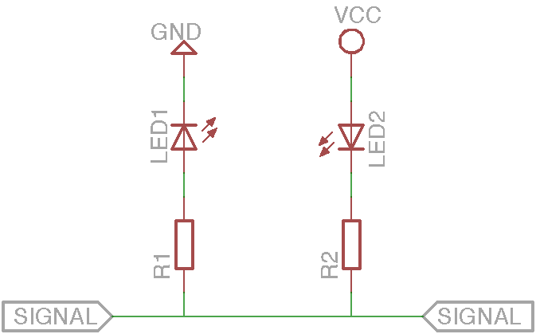

# Basic circuits
A collection of simple and basic circuits

- [LED Circuit](#led)
- [LED Indicator Circuit](#led_indicator)
- [Power Circuit](#power)
- [Diode Bridge Circuit](#diode_bridge)
- [Pull-up Resistor Circuit](#pull-up)
- [RS232 to Serial Circuit](#rs232_to_serial)
- [USB to Serial Circuit](#usb_to_serial)
- [Basic Stamp 2](#bs2)
- [Arduino](#arduino)

##<t id="led"/>LED Circuit

Is the smallest circut used to power a LED (Light Emitting Diode)

The *R1* resistor depends on the VCC voltage and on the LED type. For e 3mm LED at 5 VDC, for example, this are the rounded values:

Size | Color  | Forward current | Foward voltage | Resistor 
---- | ------ | --------------- | -------------- | --------
3mm  | Red    | 20mA            | 1.8 VDC        | 160 ohm
3mm  | Green  | 20mA            | 2.2 VDC        | 140 ohm
3mm  | Yellow | 20mA            | 2.1 VDC        | 145 ohm
3mm  | Blue   | 20mA            | 2.8 VDC        | 110 ohm

In general, the formul is:

 **R = (VCC - VL) / IL**

### Links
 - [Eagle project](led/)
 - [LED Resistor Calculator](http://www.ohmslawcalculator.com/led-resistor-calculator)

##<t id="led_indicator"/>LED Indicator Circuit

This is a example that allow you to indicate the locical value in a line.

*LED1* indicate the **1** logic state, *LED2* indicate the **0** logic state.

This is possible because a LED is a diode, so it allow the current flow only from positive to negative. When the line is at VCC, *LED1* allow current flow so it's on and *LED2* is off. Vice versa, when the line is at GND, *LED2* don't allow current flow so it's off and *LED2* is on. 

### Links
 - [Eagle project](led_indicator/)

##<t id="power"/>Power Circuit

#### TODO

### Links
 - [Diode Bridge Circuit](power/)

##<t id="diode_bridge"/>Diode Bridge Circuit

#### TODO

### Links
 - [Diode Bridge Circuit](diode_bridge/)

##<t id="pull-up"/>Pull-up Resistor Circuit

#### TODO

### Links
 - [Pull-up Resistors Tutorial](https://learn.sparkfun.com/tutorials/pull-up-resistors)

##<t id="rs232_to_serial"/>RS232 to Serial Circuit

#### TODO

##<t id="usb_to_serial"/>USB to Serial Circuit

#### TODO

##<t id="bs2"/>Basic Stamp 2

#### TODO

##<t id="arduino"/> Arduino

#### TODO
