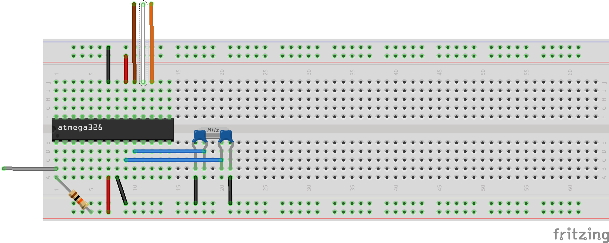
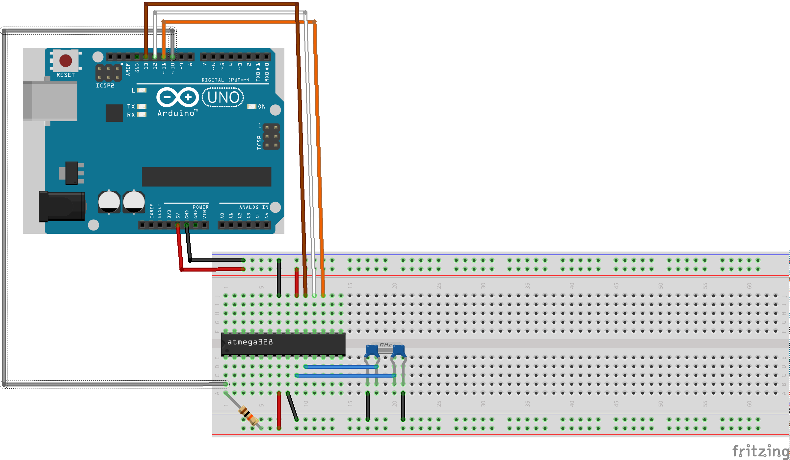

# Arduino

Arduino is an open-source electronic prototyping platform made using an ATMega microcontroller. The most popular version is the Arduino Uno that mount an ATMega328p. The difference between Arduino and a standalone AVR is the bootloader that allow us to easy develop using the Arduino IDE. Is possible to burn the bootloader into a standalone ATMega328p (and others devices ) using an AVR programmer (ISP).

- [Arduino on breadboard (ATMega328p)](#breadboard328p)
- [Arduino on breadboard (ATMega32a)](#breadboard32a)
- [Links](#links)

##<t id="breadboard328p"/> Arduino on breadboard (ATMega328p)

By default, the ATMega328p use the internal 8MHz oscillator; Arduino, instead, use a 16MHz external oscillator. The 16MHz cristall is connected to the *XTAL1* and *XTAL2* pins with 2 capacitors of **22pF** connected to *GND*. Is a good idea to add a pull-up resistor on the reset pin.

### Connect an ISP programmer

In order to configure the fuse bits and burn the bootloader an ISP is required. 

 Wire | Function
------|----------
 Gray | Reset 
 Brown | SCK 
 White | MISO 
 Orange | MOSI 

#### Arduino as ISP

Is possible to use an Arduino as ISP using a specific sketch; open this sketch by `File -> Examples -> 11.ArduinoISP -> ArduinoISP` and burn it to the original board.

#### BusPirate as ISP

In order to use a BusPirate as ISP only a simple connection is required:

 BusPirate | ATMega328p
-----------|------------
 GND | GND 
 CS | RESET 
 MOSI | MOSI 
 MISO | MISO 
 SCLK/CLK | SCK 

### Burn bootloader

The easy way to upload the bootload on e empty ATMega is to use the Arduino IDE, but also the malually way is possible.

#### Using Arduino IDE

In the `Tools` menu, select the right programmer and the right port. After this, 
it's enough to go on `Tools -> Burn Bootloader`. This operation also change the fuse bits.

#### Manually (with avrdude)

Is possible to manually burn the bootloader on the ATMega328p with avrdude; before this, is required to change the fuse bits.

###### BusPirate as ISP:
`avrdude -P PORT -c buspirate -p m328p -v -e -U efuse:w:0x05:m -U hfuse:w:0xD6:m -U lfuse:w:0xFF:m`

###### Arduino as ISP:
`avrdude -P PORT -b 19200 -c avrisp -p m328p -v -e -U efuse:w:0x05:m -U hfuse:w:0xD6:m -U lfuse:w:0xFF:m`

Now, is possible to burn the bootloader; the compiled files are available on the [Arduino repositori](https://github.com/arduino/Arduino/tree/master/hardware/arduino/avr/bootloaders).

###### BusPirate as ISP:
`avrdude -P PORT -c buspirate -p m328p -v -e -U flash:w:BOOTLOADER.hex -U lock:w:0x0F:m`

###### Arduino as ISP:
`avrdude -P PORT -b 19200 -c avrisp -p m328p -v -e -U flash:w:BOOTLOADER.hex -U lock:w:0x0F:m`

##<t id="breadboard328p"/> Arduino on breadboard (ATMega32a)

##<t id="links"/> Links
 - [Il manuale di Arduino](http://www.prometheusnow.com/blog/wp-content/uploads/2014/11/Il-manuale-di-Arduino-Maik-Schmidt.pdf)
 - [ATMega328p](http://www.atmel.com/Images/Atmel-42735-8-bit-AVR-Microcontroller-ATmega328-328P_datasheet.pdf)
