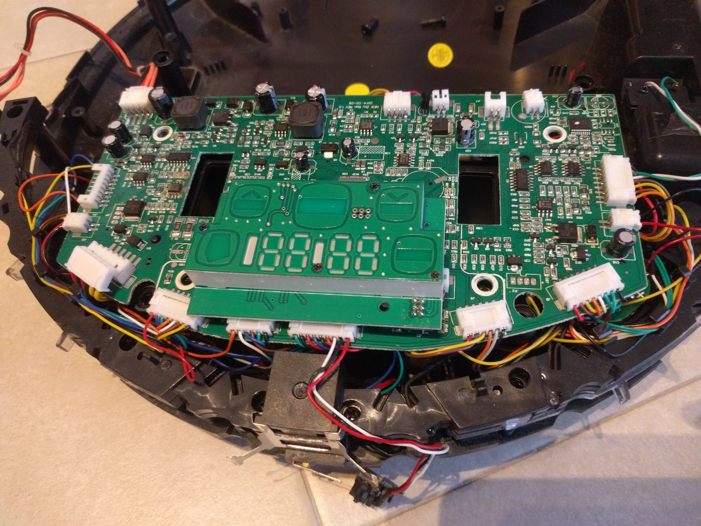
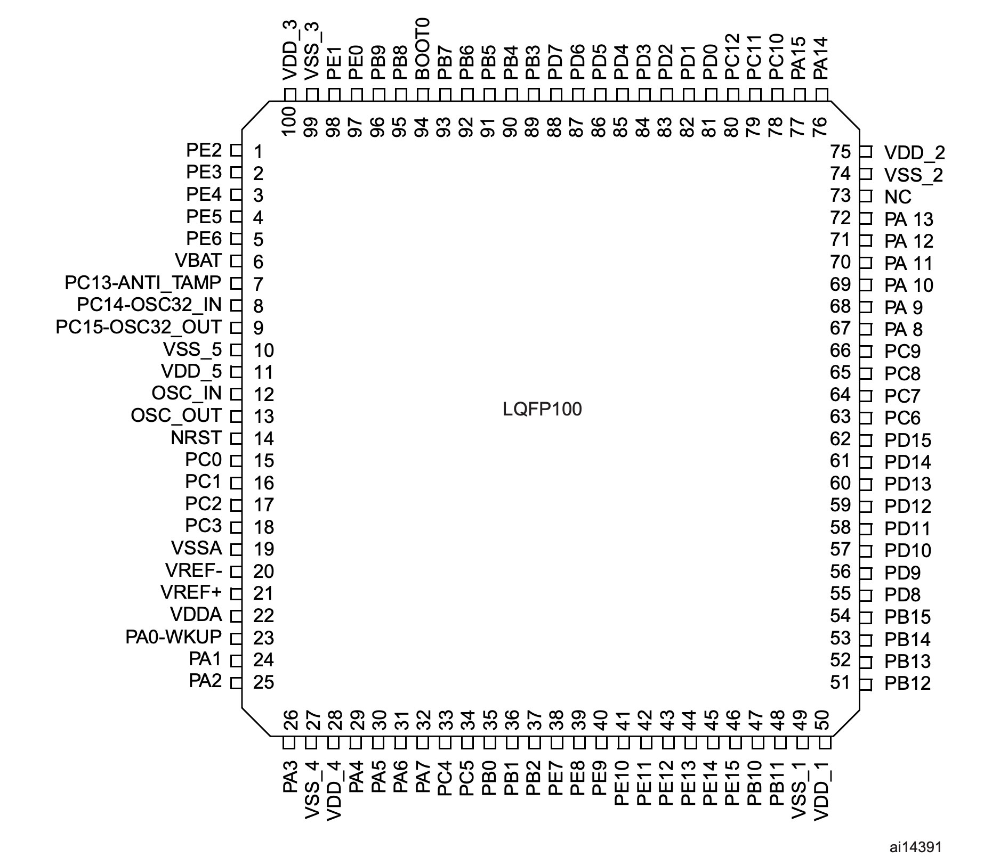
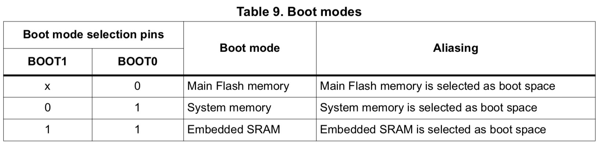
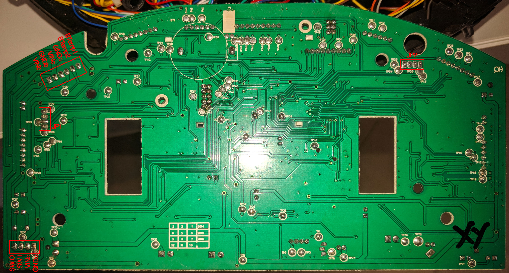
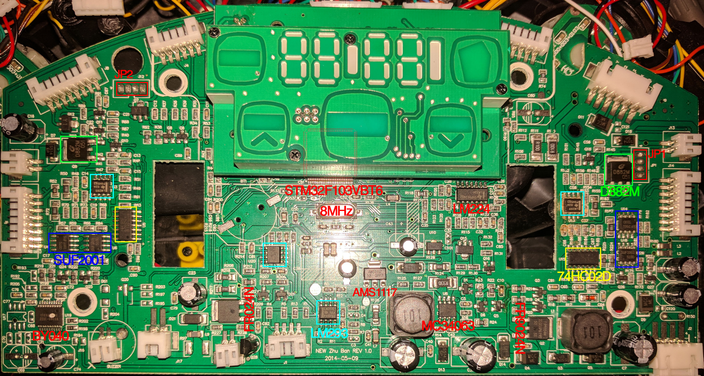
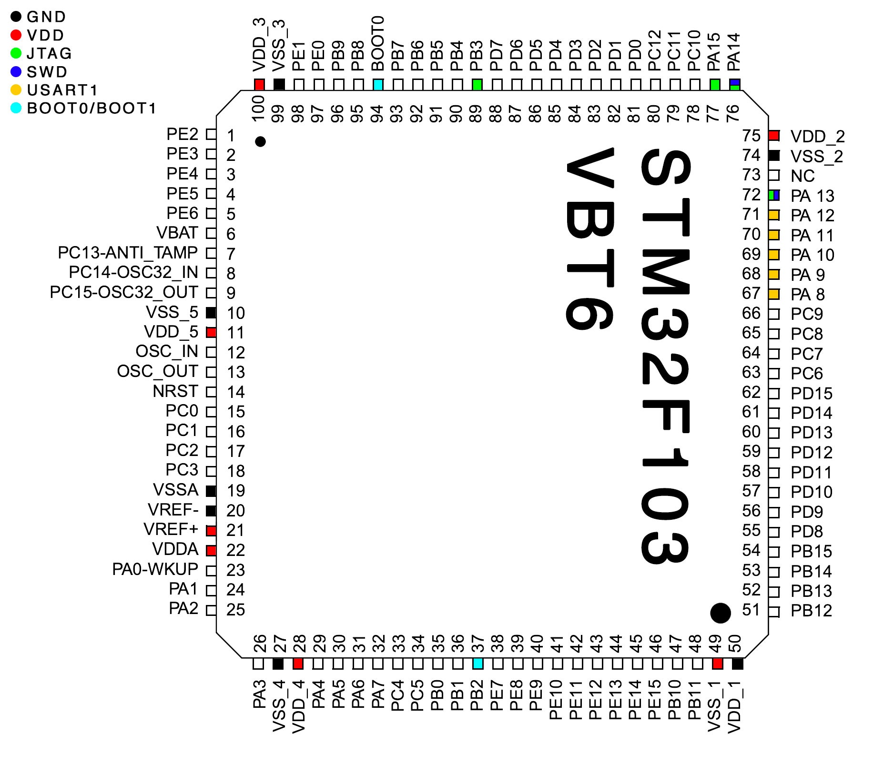
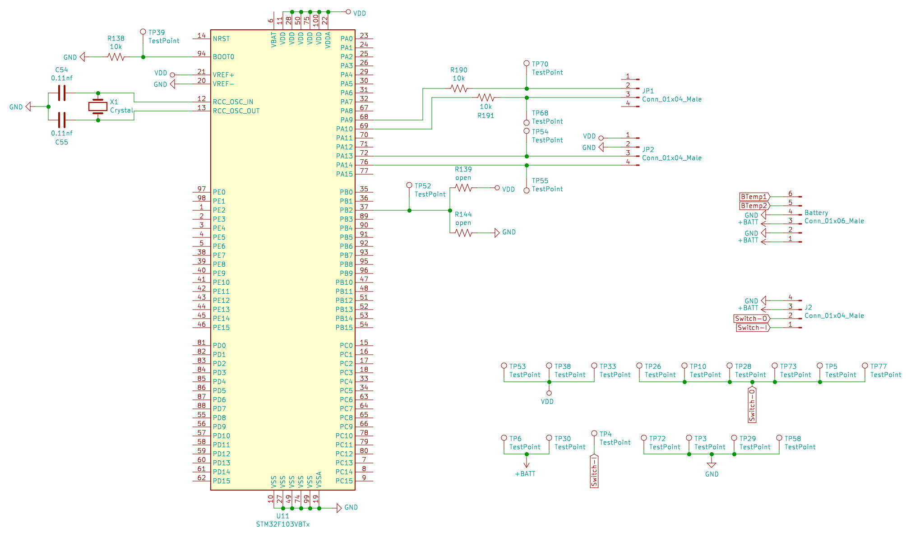
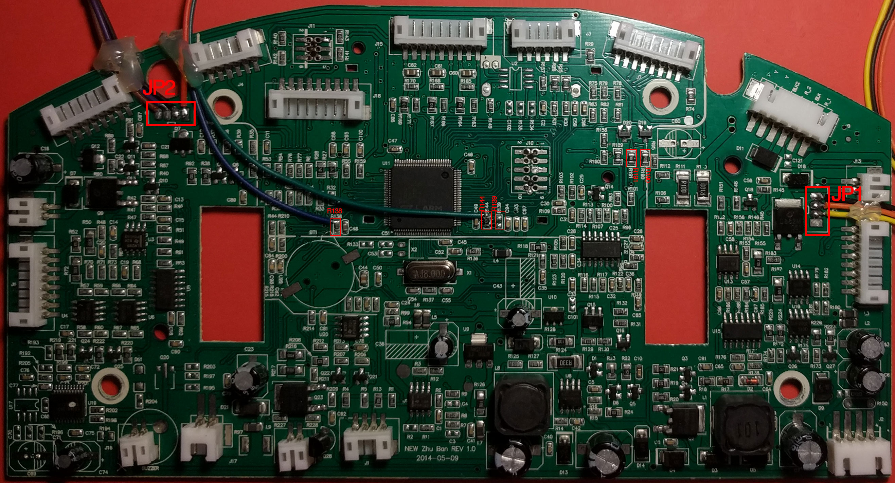

# Reverse the Haier T32X robot (Work in Progress)

I'm trying to reverse engineering the **Haier T325** Cleaning Robot. First of all I opened the plastic shell and I inspect the PCB:



After the inspection, I found the MCU, it is an [STM32F103](https://www.st.com/resource/en/datasheet/cd00161566.pdf) VBT6 in LQFP100 package, unfortunatly, the MCU is under the screen/touch panel. I don't have any experiences with this MCU, but after Googling I founded a lot of information and seems very commons. There are also many [prototype boards](https://it.aliexpress.com/item/1-pices-STM32F103C8T6-BRACCIO-STM32-Minimi-di-Sistema-Scheda-di-Sviluppo-Modulo-di-Rilevamento-di-Valutazione/32883012819.html?spm=a2g0s.13010208.99999999.275.71fe3c00kLsRht).

In the datasheet I have find the pinout schema and some interesting pins:

Pin | Port
----|------
37 | PB2 / **BOOT1**
37 | PB2 / **BOOT1**
67 | PA8 / **USART1_CK** / TIM1_CH1/MCO
68 | PA9 / **USART1_TX** / TIM1_CH2
69 | PA10 / **USART1_RX** / TIM1_CH3
70 | PA11 / **USART1_CTS** / CANRX / USBDM / TIM1_CH4
71 | PA12 / **USART1_RTS** / CANTX / USBDP / TIM1_ETR
72 | PA13 / **JTMS** / **SWDIO**
76 | PA14 / **JTCK** / **SWCLK**
77 | PA15 / **JTDI**
89 | PB3 / **JTDO** / TRACESWO
94 | **BOOT0**



In the STM32F10xxx, 3 different boot modes can be selected through BOOT[1:0] pins:



In order to ease the work, I dismounted the PCB from the robot and I found that in the bottom of the board that the manufacturer had made a lot of test connection pads:



The unsoldered jumpers JP1 and JP2 seems interesting.

So, first of all, I wanted to find GND and VDD pins on the STM32F103. GND reference was easy to find on switch or battery connection, but for VDD I must finded the 3V3 regulator, so I checked all main components of the board and I have searched their datasheet on internet:

Count | Name | Purpose
------|-----|------
1 | BY040 | ?
4 | SUF2001 | [30V Dual N- and P-channel Trench MOSFET](http://www.kodenshi-tk.co.jp/products/power_semi_device/pdf/mosfet_03/03-10_SUF2001.pdf)
4 | LM293 | [Dual Comparators](http://www.ti.com/lit/ds/symlink/lm2903-n.pdf)
1 | MC34063 | [Step−Up/Down/Inverting Switching Regulators](https://www.sparkfun.com/datasheets/IC/MC34063A.pdf)
1 | 74HC02D | [Quad 2-input NOR gate](https://assets.nexperia.com/documents/data-sheet/74HC_HCT02.pdf)
1 | LM224 | [Quadruple Operational Amplifiers](http://www.ti.com/lit/ds/symlink/lm324.pdf)
2 | D882M | [General Purpose Transistors](https://cdn.datasheetspdf.com/pdf-down/D/8/8/D882M-JCET.pdf)
1 | FR9024N | [Power MOSFET](https://www.vishay.com/docs/91278/sihfr902.pdf)
1 | FR024N | [Power MOSFET](https://www.vishay.com/docs/91264/91264.pdf)
1 | AMS1117 | [1A LOW DROPOUT VOLTAGE REGULATOR (3V3)](http://www.advanced-monolithic.com/pdf/ds1117.pdf)



With all the data, I started to investigate the MCU and I checked the accessible GND and VDD pins, but something's not right, the ground position doesn't match the datasheet pinout but, probably, the text over the chip are only tourned of 90°.

I must inspect all pins and, for this purpose, I have unsoldered the control panel. I don't have a lot of experience in unsoldering and I have damaged the pads, but, after this operation, I have access to all pins of the MCU and I have the confirmed my hypothesis:



At this time, I took sufficient data to find the SWD, USART1 and BOOT pins over the board. This operation can be done using a multimeter and a lot of patience. Following the tracks of the PCB we can have an idea of the connections and then we can check it with the multimeter short circuit test. Be careful that the PCBs can many layers (usually 2, top and bottom) and that layers can be connected by VIAs (vertical interconnect access). Tracks and VIAs can be placed under other components.

Jumper | Pin 1 | Pin 2 | Pin 3 | Pin 4
-------|-------|-------|-------|-------
**JP1** | VDD | TX | RX | GND
**JP2** | VDD | GDN | *SWDIO* | *SWCLK*



Good, when I have find all I need, I solder some cables for JP1, JP2, BOOT0 and BOOT1. I soldered also the missing R144 resistor (*10k*) in order to make a boot selector:



## Ready to test SWD!

I done some tests using the *BusPirate* w/o succes, but with 9.99€ I can buy an *ST-Link V2* for the day after on [Amazon](https://www.amazon.it/gp/product/B077Z1T3LP/ref=oh_aui_detailpage_o03_s00?ie=UTF8&psc=1). I connected JP2 to the ST-link and ST-Link to may Mac.

### st-link

I have installed the ST-Link utilities and run `st-info --probe`:

```
> st-info --probe                                                                                                                                            ~/Documents/Ciotto/Haier-T32X@MBP-18.local
Found 1 stlink programmers
 serial: 543f6e064966505629660667
openocd: "\x54\x3f\x6e\x06\x49\x66\x50\x56\x29\x66\x06\x67"
  flash: 0 (pagesize: 1024)
   sram: 20480
 chipid: 0x0410
  descr: F1 Medium-density device
```

**BOOM!!** It works!

```
> st-flash read image.bin 0x8000000 1024
st-flash 1.5.1
2018-11-25T21:33:33 INFO common.c: Loading device parameters....
2018-11-25T21:33:33 INFO common.c: Device connected is: F1 Medium-density device, id 0x20036410
2018-11-25T21:33:33 INFO common.c: SRAM size: 0x5000 bytes (20 KiB), Flash: 0 bytes (0 KiB) in pages of 1024 bytes
```

The device was recognised but, unfortunately, when I tried to dump the firmware, the image file was empty.

This probably means that the MCU have some type of protection enabled.

#### Disable Debug

When debug is disabled still possible to dump the firmware and, after this, we can modify it and reflash, unfortunately this does not seem to be my problem because I can't dump the firmware.

#### Read Out protection

STM32 support 3 protection levels:

  - **Level 0**: no read protection

    This essentially means that there aren't protection, but can still that Disable Debug was enabled.

  - **Level 1**: memory read protection enabled
    
    If a debug access is detected or boot is not set to flash memory area a system fault is generated. Mass-erase is allowed.
    
  - **Level 2**: memory read protection enabled and all debug features disabled.

    All protections provided by *Level 1*, but JTAG/SWD are disabled and chip can't be resetted.

Probably the Read Out protection is setted to *Level 1* because i can use SWD but I can't dump the firmware. In ther [PentestHardware](https://github.com/unprovable/PentestHardware) manual there are some usefull ideas for bypass this protection, but for now i try to inspect the **UART**.

#### Links

  - [stlink issue](https://github.com/texane/stlink/issues/545)
  - [Read Out protection](https://www.st.com/content/ccc/resource/training/technical/product_training/group0/f5/5e/87/93/f5/d7/45/85/STM32F7_Security_Memories_Protections/files/STM32F7_Security_Memories_Protections.pdf/_jcr_content/translations/en.STM32F7_Security_Memories_Protections.pdf)


### openocd

```
> openocd -f haier-t32x.cfg
Open On-Chip Debugger 0.10.0
Licensed under GNU GPL v2
For bug reports, read
	http://openocd.org/doc/doxygen/bugs.html
Info : The selected transport took over low-level target control. The results might differ compared to plain JTAG/SWD
adapter speed: 1000 kHz
adapter_nsrst_delay: 100
none separate
Info : Unable to match requested speed 1000 kHz, using 950 kHz
Info : Unable to match requested speed 1000 kHz, using 950 kHz
Info : clock speed 950 kHz
Info : STLINK v2 JTAG v17 API v2 SWIM v4 VID 0x0483 PID 0x3748
Info : using stlink api v2
Info : Target voltage: 3.516645
Info : stm32f1x.cpu: hardware has 6 breakpoints, 4 watchpoints
```

In other terminal:

```
> telnet localhost 4444
Trying ::1...
telnet: connect to address ::1: Connection refused
Trying 127.0.0.1...
Connected to localhost.
Escape character is '^]'.
Open On-Chip Debugger
> flash probe 0
device id = 0x20036410
STM32 flash size failed, probe inaccurate - assuming 128k flash
flash size = 128kbytes
flash 'stm32f1x' found at 0x08000000
> dump_image image.bin 0x08000000 0x20000

> 
```

#### Links

  - [Getting started with OpenOCD](http://techwithdave.davevw.com/2013/07/getting-started-with-openocd.html)

### gdb

```
> openocd -f haier-t32x.cfg
Open On-Chip Debugger 0.10.0
Licensed under GNU GPL v2
For bug reports, read
	http://openocd.org/doc/doxygen/bugs.html
Info : The selected transport took over low-level target control. The results might differ compared to plain JTAG/SWD
adapter speed: 1000 kHz
adapter_nsrst_delay: 100
none separate
Info : Unable to match requested speed 1000 kHz, using 950 kHz
Info : Unable to match requested speed 1000 kHz, using 950 kHz
Info : clock speed 950 kHz
Info : STLINK v2 JTAG v17 API v2 SWIM v4 VID 0x0483 PID 0x3748
Info : using stlink api v2
Info : Target voltage: 3.516645
Info : stm32f1x.cpu: hardware has 6 breakpoints, 4 watchpoints
```

In other terminal:

```
> ./arm-none-eabi-gdb
GNU gdb (GNU Tools for Arm Embedded Processors 7-2018-q2-update) 8.1.0.20180315-git
Copyright (C) 2018 Free Software Foundation, Inc.
License GPLv3+: GNU GPL version 3 or later <http://gnu.org/licenses/gpl.html>
This is free software: you are free to change and redistribute it.
There is NO WARRANTY, to the extent permitted by law.  Type "show copying"
and "show warranty" for details.
This GDB was configured as "--host=x86_64-apple-darwin10 --target=arm-none-eabi".
Type "show configuration" for configuration details.
For bug reporting instructions, please see:
<http://www.gnu.org/software/gdb/bugs/>.
Find the GDB manual and other documentation resources online at:
<http://www.gnu.org/software/gdb/documentation/>.
For help, type "help".
Type "apropos word" to search for commands related to "word".
(gdb) target remote localhost:3333
Remote debugging using localhost:3333
warning: No executable has been specified and target does not support
determining executable automatically.  Try using the "file" command.
0x0800018c in ?? ()
(gdb) dump binary memory image.bin 0x08000000 0x08001000
```

## Check the UART

Unfortunately I get poor results with the **SWD** interface, so I start to inspect the **UART**.

I attached my USB-to-Serial interface, I runned miniterm with most used baud rate and I reboot the board:

```
> python -m serial.tools.miniterm /dev/tty.usbserial-A50285BI 115200
--- Miniterm on /dev/tty.usbserial-A50285BI  115200,8,N,1 ---
--- Quit: Ctrl+] | Menu: Ctrl+T | Help: Ctrl+T followed by Ctrl+H ---
怆�����x<f<␀x␃̆�␀x␏���f<␆<������~<␀x␌���␘<��`?���␀x␀��␆<������~<␀x�φ�x<f<␀x␌�f<`?`?f<␘?␆␌��怘��␘0␆<␞?f<������f<␞0f?␘?␘?f<��`?␀x�x␀�␀�␆␏␘␏␘␏���␘0␆<`?`?f<␘?�␞␀x<�����`?␆<~<f<␀x�x␀�␆␏f␏�x<�
```

Well, something happened. After some try with other common used baud rate, I got the out put:

```
> python -m serial.tools.miniterm /dev/tty.usbserial-A50285BI 57600
--- Miniterm on /dev/tty.usbserial-A50285BI  57600,8,N,1 ---
--- Quit: Ctrl+] | Menu: Ctrl+T | Help: Ctrl+T followed by Ctrl+H ---
Ilife AI Cleaning Robot
  Making life better!

BaseLineCurrent = 0122
Battery Voltage = 1596
```

When I tried to start the board with BOOT0 to 3V3 there was no output, so probably this confirm that the **Read Out protection** is setted to *Level 1* or *Level 2*.

When I attached the charger, the robot logged ` Charge Start` over serial, but when I press buttons over IR remote or send command with the UART, nothing is happening.