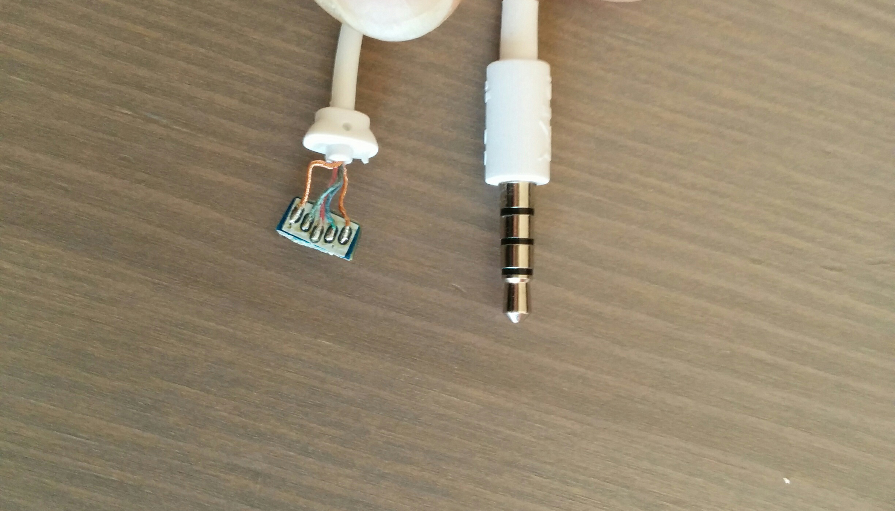
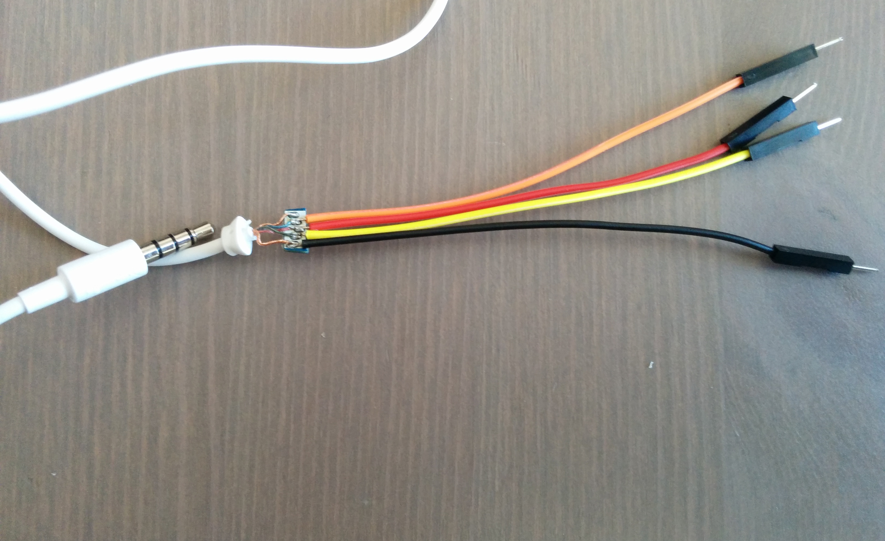
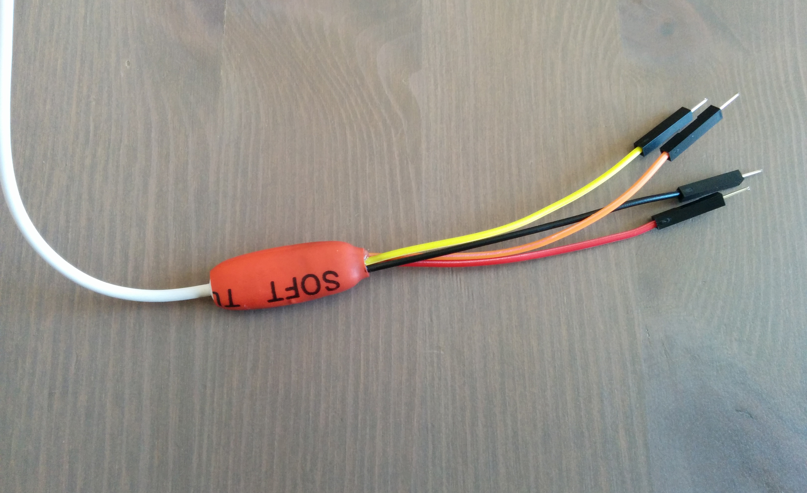
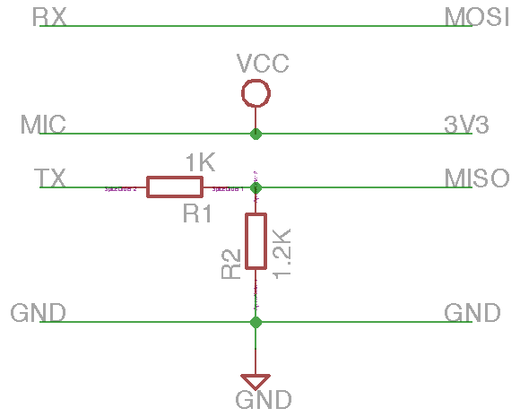

# Devices UART

- [Nexus](#nexus)
- [Links](#links)


##<t id="nexus"/> Nexus

#### <t style="color: red">WARNING!!</t> After first try, I couldn't read nothing so probably something is wrong

Many *Google Nexus* devices provide a serial console over the audio jack, unfortunately, there isn't a compatible serial adapter on market. After reading [some articles](http://www.pabr.org/consolejack/consolejack.en.html), I tryed to make an adapter using old headphones with microphone and a [BusPirate](http://dangerousprototypes.com/docs/Bus_Pirate).

I opened the mic box of the headphones and I cut the PCB near the cord soldering, by this way was more easy to solder my Dupont cables and keep them separated.



I checked the continuity, in my case this is the situation:

```
 < 1 | 2 | 3 | 4 [


-- 3 - GND - Common
-- 2 - RX  - Right  - Orange
-- 4 - 3V3 - Mic    - Red
-- 1 - TX  - Left   - Yellow
-- 3 - GND - Common - Black
```


After this, I soldered the cords...



...and I closed all with hot glue and with the shrink tube. Now, I can easy connect my phone with the breadbord.



I made a simple voltage divider:



The voltage divider is necessary because, by specific, the *Nexus* UART work at **1.8V** and the BusPirate, in normal mode, work at **3.3V**, so *V<sub>out</sub> = (R<sub>2</sub> / (R<sub>2</sub> + R<sub>1</sub>)) \* V<sub>in</sub> = (1200 / (1200+1000)) \* 3.3 = 1.8V*.

At this point, I tryed to connect the BusPirate to my Mac and I opened serial using `serial.tools.miniterm` (or `screen`):

```
> python -m serial.tools.miniterm /dev/tty.usbserial-A7036EBS 115200 --eol LF
--- Miniterm on /dev/tty.usbserial-A7036EBS  115200,8,N,1 ---
--- Quit: Ctrl+] | Menu: Ctrl+T | Help: Ctrl+T followed by Ctrl+H ---
```

I put the BusPirate in *UART* mode:

```
HiZ>m
1. HiZ
2. 1-WIRE
3. UART
4. I2C
5. SPI
6. 2WIRE
7. 3WIRE
8. LCD
x. exit(without change)

(1)>3
Set serial port speed: (bps)
 1. 300
 2. 1200
 3. 2400
 4. 4800
 5. 9600
 6. 19200
 7. 38400
 8. 57600
 9. 115200
10. BRG raw value

(1)>9
Data bits and parity:
 1. 8, NONE *default 
 2. 8, EVEN 
 3. 8, ODD 
 4. 9, NONE
(1)>
Stop bits:
 1. 1 *default
 2. 2
(1)>
Receive polarity:
 1. Idle 1 *default
 2. Idle 0
(1)>
Select output type:
 1. Open drain (H=Hi-Z, L=GND)
 2. Normal (H=3.3V, L=GND)

(1)>2
Ready
UART>
UART>W
POWER SUPPLIES ON
```

I enabled the bridge mode:

```
UART>(1)
UART bridge
Reset to exit
Are you sure? y
```

And I run my Nexus 5:

```
welcome to hammerhead bootloader
[10] Power on reason 80
[10] DDR: hynix
[110] Loaded IMGDATA at 0x11000000
[110] Display Init: Start
[190] MDP GDSC already enabled
[190] bpp 24
[230] Config MIPI_CMD_PANEL.
[230] display panel: ORISE
[280] Found Appeneded Flattened Device tree
[280] DTB: platform id 126, board id 150, soc rev 20002, board rev 11
[320] Set panel ON cmds [35]
[440] Turn on MIPI_CMD_PANEL.
[490] Display Init: Done
[490] cable type from shared memory: 8
[490] reboot_mode restart reason = power_on
[540] vibe
[640] splash: boot
[680] splash: unlocked
[720] use_signed_kernel=0, is_unlocked=1, is_tampered=1.
[720] Loading boot image (9371648): start
[1050] Loading boot image (9371648): done
[1060] Found Appeneded Flattened Device tree
[1060] DTB: platform id 126, board id 150, soc rev 20002, board rev 11
[1070] get_display_kcal = 0, 0, 0, x
[1070] 
Booting Linux
[1070] cmdline: console=ttyHSL0,115200,n8 androidboot.hardware=hammerhead user_debug=31 maxcpus=2 msm_watchdog_v2.enable=1 uart_console=enable gpt=enable lge.kcal=0|0|0|x lge.rev=rev_11 androidboot.laf androidboot.emmc=true androidboot.serialno=0335d77208e7e12a [1100] Updating device tree: start
[1110] Updating device tree: done
[1110] booting linux @ 0x8000, ramdisk @ 0x2900000 (918167), tags/device tree @ 0x2700000
[1120] Turn off MIPI_CMD_PANEL.
[1120] Continuous splash enabled, keeping panel alive.
[    0.000000] Booting Linux on physical CPU 0
[    0.000000] Initializing cgroup subsys cpu
[    0.000000] Linux version 3.4.0-g7717f76 (android-build@kpfi6.cbf.corp.google.com) (gcc version 4.8 (GCC) ) #1 SMP PREEMPT Wed Nov 4 21:42:24 UTC 2015
[    0.000000] CPU: ARMv7 Processor [512f06f0] revision 0 (ARMv7), cr=10c5387d
[    0.000000] CPU: PIPT / VIPT nonaliasing data cache, PIPT instruction cache
[    0.000000] Machine: Qualcomm MSM 8974 HAMMERHEAD (Flattened Device Tree), model: LGE MSM 8974 HAMMERHEAD
[    0.000000] qcom,ion-heap@28 reserved EBI1 size 614000
[    0.000000] qcom,mdss_fb_primary reserved EBI1 size 1000000
[    0.000000] qcom,msm-contig-mem reserved EBI1 size 280000
[    0.000000] Node qcom,msm-mem-hole removed memory 7b00000-ff00000
[    0.000000] memory pool 3 (start 0x7e700000 size 1900000) initialized
[    0.000000] PERSIST RAM CONSOLE START ADDR : 0x10000000
[    0.000000] Initialized persistent memory from 10000000-100fffff
[    0.000000] cma: CMA: reserved 16 MiB at 36c00000
[    0.000000] cma: Found secure_region, memory base 0, size 252 MiB
[    0.000000] cma: CMA: reserved 252 MiB at 6e800000
[    0.000000] cma: Found adsp_region, memory base 0, size 32 MiB
[    0.000000] cma: CMA: reserved 32 MiB at 6c800000
[    0.000000] cma: Found qsecom_region, memory base 0, size 17 MiB
[    0.000000] cma: CMA: reserved 20 MiB at 6b400000
[    0.000000] Memory policy: ECC disabled, Data cache writealloc
[    0.000000] IMEM DT static mapping successful
[    0.000000] PERCPU: Embedded 7 pages/cpu @c2403000 s15680 r0 d12992 u32768
[    0.000000] Built 1 zonelists in Zone order, mobility grouping on.  Total pages: 480000
[    0.000000] Kernel command line: console=ttyHSL0,115200,n8 androidboot.hardware=hammerhead user_debug=31 maxcpus=2 msm_watchdog_v2.enable=1 uart_console=enable gpt=enable lge.kcal=0|0|0|x lge.rev=rev_11 androidboot.laf androidboot.emmc=true androidboot.serialno=0335d77208e7e12a androidboot.bootloader=HHZ12k androidboot.baseband=msm bootreason=power_on androidboot.hardware.sku=D821 androidboot.hardware.ddr=hynix androidboot.hardware.display=orise
[    0.000000] UART CONSOLE : enable
[    0.000000] BOARD : LGE rev_11 
[    0.000000] PID hash table entries: 4096 (order: 2, 16384 bytes)
[    0.000000] Dentry cache hash table entries: 131072 (order: 7, 524288 bytes)
[    0.000000] Inode-cache hash table entries: 65536 (order: 6, 262144 bytes)
[    0.000000] Memory: 123MB 1768MB = 1891MB total
[    0.000000] Memory: 1570740k/1570740k available, 391244k reserved, 846848K highmem
[    0.000000] Virtual kernel memory layout:
[    0.000000]     vector  : 0xffff0000 - 0xffff1000   (   4 kB)
[    0.000000]     fixmap  : 0xfff00000 - 0xfffe0000   ( 896 kB)
[    0.000000]     vmalloc : 0xf0000000 - 0xff000000   ( 240 MB)
[    0.000000]     lowmem  : 0xc0000000 - 0xef800000   ( 760 MB)
[    0.000000]     pkmap   : 0xbfe00000 - 0xc0000000   (   2 MB)
[    0.000000]       .text : 0xc0008000 - 0xc0f14a68   (15411 kB)
[    0.000000]       .init : 0xc1000000 - 0xc1130d40   (1220 kB)
[    0.000000]       .data : 0xc1132000 - 0xc11ff054   ( 821 kB)
[    0.000000]        .bss : 0xc11ff078 - 0xc13b87fc   (1766 kB)
[    0.000000] SLUB: Genslabs=11, HWalign=64, Order=0-3, MinObjects=0, CPUs=4, Nodes=1
[    0.000000] Preemptible hierarchical RCU implementation.
[    0.000000] 	RCU dyntick-idle grace-period acceleration is enabled.
[    0.000000] 	Dump stacks of tasks blocking RCU-preempt GP.
[    0.000000] NR_IRQS:16 nr_irqs:16 16
[    0.000000] sched_clock: 32 bits at 19MHz, resolution 52ns, wraps every 223696ms
[    0.000000] Switching to timer-based delay loop
[    0.000000] Console: colour dummy device 80x30
[    0.000088] Calibrating delay loop (skipped), value calculated using timer frequency.. 38.40 BogoMIPS (lpj=192000)
[    0.000109] pid_max: default: 32768 minimum: 301
[    0.000280] Security Framework initialized
[    0.000308] SELinux:  Initializing.
[    0.000439] Mount-cache hash table entries: 512
[    0.001294] Initializing cgroup subsys debug
[    0.001307] Initializing cgroup subsys cpuacct
[    0.001318] Initializing cgroup subsys freezer
[    0.001361] CPU: Testing write buffer coherency: ok
[    0.001396] ftrace: allocating 30778 entries in 91 pages
[    0.113283] CPU0: thread -1, cpu 0, socket 0, mpidr 80000000
[    0.114060] hw perfevents: enabled with ARMv7 Krait PMU driver, 5 counters available
[    0.117206] Setting up static identity map for 0xa6b650 - 0xa6b6d8
[    0.117222] MSM Memory Dump table set up
[    0.118712] CPU1: thread -1, cpu 1, socket 0, mpidr 80000001
[    0.118792] Brought up 2 CPUs
[    0.118804] SMP: Total of 2 processors activated (76.80 BogoMIPS).
[    0.130545] dummy: 
[    0.142830] NET: Registered protocol family 16
[    0.145254] DMA: preallocated 256 KiB pool for atomic coherent allocations
[    0.146678] socinfo_print: v8, id=126, ver=2.2, raw_id=1968, raw_ver=7, hw_plat=150, hw_plat_ver=65536
[    0.146683]  accessory_chip=0, hw_plat_subtype=0, pmic_model=65537, pmic_die_revision=196609
[    0.161073] gpiochip_add: registered GPIOs 0 to 145 on device: msmgpio
[    0.177467] msm_watchdog f9017000.qcom,wdt: MSM Watchdog Initialized
[    0.196584] 8841_s1: 675 <--> 1050 mV at 0 mV normal idle 
[    0.197034] 8841_s1_ao: 675 <--> 1050 mV at 0 mV normal idle 
[    0.197494] 8841_s1_so: 675 <--> 1050 mV at 675 mV normal idle 
[    0.197995] 8841_s2: 500 <--> 1050 mV at 0 mV normal idle 
[    0.198448] 8841_s2_corner: 0 <--> 0 mV at 0 mV normal idle 
[    0.198915] 8841_s2_corner_ao: 0 <--> 0 mV at 0 mV normal idle 
[    0.199365] 8841_s2_floor_corner: 0 <--> 0 mV at 0 mV normal idle 
[    0.199858] 8841_s3: 1050 mV normal idle 
[    0.200337] 8841_s4: 815 <--> 900 mV at 0 mV normal idle 
[    0.200813] 8841_s4_corner: 0 <--> 0 mV at 0 mV normal idle 
[    0.201280] 8841_s4_floor_corner: 0 <--> 0 mV at 0 mV normal idle 
[    0.201764] 8941_s1: 1300 mV normal idle 
[    0.202260] 8941_s2: 2150 mV normal idle 
[    0.202749] 8941_s3: 1800 mV normal idle 
[    0.203252] 8941_l1: 1225 mV normal idle 
[    0.203766] 8941_l2: 1200 mV normal idle 
[    0.204263] 8941_l3: 1225 mV normal idle 
[    0.204755] 8941_l4: 1225 mV normal idle 
[    0.205264] 8941_l5: 1800 mV normal idle 
[    0.205745] 8941_l6: 1800 mV normal idle 
[    0.206228] 8941_l7: 1800 mV normal idle 
[    0.206734] 8941_l8: 1800 mV normal idle 
[    0.207210] 8941_l9: 1800 <--> 2950 mV at 2950 mV normal idle 
[    0.207691] 8941_l10: 1800 <--> 2950 mV at 2950 mV normal idle 
[    0.208171] 8941_l11: 1300 mV normal idle 
[    0.208675] 8941_l12: 1800 mV normal idle 
[    0.209131] 8941_l12_ao: 1800 mV normal idle 
[    0.209611] 8941_l13: 1800 <--> 2950 mV at 2950 mV normal idle 
[    0.210105] 8941_l14: 1800 mV normal idle 
[    0.210584] 8941_l15: 2050 mV normal idle 
[    0.211078] 8941_l16: 2700 mV normal idle 
[    0.211561] 8941_l17: 3000 mV normal idle 
[    0.212057] 8941_l18: 2850 mV normal idle 
[    0.212550] 8941_l19: 3000 <--> 3300 mV at 3300 mV normal idle 
[    0.213035] 8941_l20: 2950 mV normal idle 
[    0.213563] 8941_l21: 2950 mV normal idle 
[    0.214046] 8941_l22: 3000 <--> 3300 mV at 3100 mV normal idle 
[    0.214558] 8941_l23: 3000 mV normal idle 
[    0.215046] 8941_l24: 3075 mV normal idle 
[    0.215534] 8941_lvs1: 
[    0.215963] 8941_lvs2: 
[    0.216414] 8941_lvs3: 
[    0.218499] PDN krait_pdn_phase_scaling_init: eFuse phase scaling factor = 3/4
[    0.218510] PDN krait_pdn_phase_scaling_init: initial phase scaling factor = 3/4
[    0.218840] krait0: 500 <--> 1100 mV at 900 mV fast normal idle 
[    0.219381] krait1: 500 <--> 1100 mV at 900 mV fast normal idle 
[    0.219898] krait2: 500 <--> 1100 mV at 900 mV fast normal idle 
[    0.220427] krait3: 500 <--> 1100 mV at 900 mV fast normal idle 
[    0.253476] vdd_restriction_reg_init:Defer vdd rstr freq init
[    0.254170] persistent_ram: error in header, 7
[    0.254180] persistent_ram: no valid data in buffer (sig = 0x00000000)
[    0.265652] console [ram-1] enabled
[    0.265836] persistent_ram: no valid data in buffer (sig = 0x80000000)
[    0.266139] wifi: bcm_init_wlan_mem: WIFI MEM Allocated
[    0.266213] bcm_wifi_init_gpio_mem: wifi gpio and mem initialized
[    0.266465] hw-breakpoint: found 5 (+1 reserved) breakpoint and 4 watchpoint registers.
[    0.266541] hw-breakpoint: maximum watchpoint size is 8 bytes.
[    0.269967] gpiochip_add: registered GPIOs 1020 to 1023 on device: pm8841-mpp
[    0.272204] spmi_pmic_arb fc4cf000.qcom,spmi: PPID 0xd0 incorrect owner 4
[    0.272365] spmi_pmic_arb fc4cf000.qcom,spmi: PPID 0xd1 incorrect owner 4
[    0.272742] spmi_pmic_arb fc4cf000.qcom,spmi: PPID 0xd4 incorrect owner 4
[    0.273391] spmi_pmic_arb fc4cf000.qcom,spmi: PPID 0xdb incorrect owner 2
[    0.273784] spmi_pmic_arb fc4cf000.qcom,spmi: PPID 0xde incorrect owner 2
[    0.274439] gpiochip_add: registered GPIOs 984 to 1019 on device: pm8941-gpio
[    0.279696] spmi_pmic_arb fc4cf000.qcom,spmi: PPID 0xa2 incorrect owner 2
[    0.280361] gpiochip_add: registered GPIOs 977 to 983 on device: pm8941-mpp
[    0.281912] 8941_boost: 5000 mV 
[    0.282537] 8941_mvs1: 
[    0.282648] 8941_mvs1: supplied by 8941_boost
[    0.283196] 8941_mvs2: 
[    0.283358] 8941_mvs2: supplied by 8941_boost
[    0.284311] earjack_debugger_probe: earjack debugger probed
[    0.286803] qpnp_adcmap_probe: Use adcmap from dt
[    0.287556] sps:BAM 0xf9984000 (va:0xf0060000) enabled: ver:0x6, number of pipes:20
[    0.287634] sps:BAM 0xf9984000 is registered.
[    0.287775] sps:sps is ready.
[    0.289818] gdsc_venus: 
[    0.290269] gdsc_mdss: 
[    0.290734] gdsc_jpeg: 
[    0.291173] gdsc_vfe: 
[    0.291545] gdsc_oxili_gx: 
[    0.291675] gdsc_oxili_gx: supplied by 8841_s4_corner
[    0.292359] gdsc_oxili_cx: 
[    0.292716] gdsc_usb_hsic: 
[    0.293382] AXI: msm_bus_fabric_init_driver(): msm_bus_fabric_init_driver
[    0.300008] msm_ocmem fdd00000.qcom,ocmem: OCMEM Virtual addr f0400000
[    0.301799] Physical OCMEM zone layout:
[    0.301950]  zone graphics	: 0xfec00000 - 0xfecfffff (1024 KB)
[    0.302027]  zone lp_audio	: 0xfed00000 - 0xfed7ffff ( 512 KB)
[    0.302161]  zone video	: 0xfed00000 - 0xfed7ffff ( 512 KB)
[    0.328039] bio: create slab <bio-0> at 0
[    0.329091] ethernet_phy: 
[    0.329572] avdd-3p3: 
[    0.329975] vdd-1p0: 
[    0.330877] cma: Assigned CMA region at 0 to 8.qcom,ion-heap device
[    0.331076] ION-heap mm: Cannot specify alignment for this type of heap
[    0.331225] cma: Assigned CMA region at 0 to 16.qcom,ion-heap device
[    0.331425] ION-heap adsp: Cannot specify alignment for this type of heap
[    0.331709] cma: Assigned CMA region at 0 to 1b.qcom,ion-heap device
[    0.332157] ION heap vmalloc created
[    0.332335] ION heap kmalloc created
[    0.332483] ION heap mm created
[    0.332577] ION heap adsp created
[    0.332668] ION heap iommu created
[    0.332815] ION heap qsecom created
[    0.332924] ION heap audio created at 0x7e701000 with size 614000
[    0.334241] SCSI subsystem initialized
[    0.334484] usbcore: registered new interface driver usbfs
[    0.334623] usbcore: registered new interface driver hub
[    0.334850] usbcore: registered new device driver usb
[    0.335835] Linux media interface: v0.10
[    0.335953] Linux video capture interface: v2.00
[    0.336749] PMIC@SID0 Power-on reason: Triggered from KPD (power key press)
[    0.336835] PMIC@SID0: Power-off reason: Triggered from PS_HOLD (PS_HOLD/MSM controlled shutdown)
[    0.337177] input: qpnp_pon as /virtual/input/input0
[    0.339618] msm_iommu_v1 fda64000.qcom,iommu: device jpeg_iommu mapped at f01e0000, with 3 ctx banks
[    0.340886] msm_iommu_v1 fd928000.qcom,iommu: device mdp_iommu mapped at f0280000, with 3 ctx banks
[    0.342734] msm_iommu_v1 fdc84000.qcom,iommu: device venus_iommu mapped at f02a0000, with 5 ctx banks
[    0.343705] msm_iommu_v1 fdb10000.qcom,iommu: device kgsl_iommu mapped at f02c0000, with 2 ctx banks
[    0.344874] msm_iommu_v1 fda44000.qcom,iommu: device vfe_iommu mapped at f02e0000, with 3 ctx banks
[    0.345960] msm_iommu_ctx_v1 fda6c000.qcom,iommu-ctx: context jpeg_enc0 using bank 0
[    0.346146] msm_iommu_ctx_v1 fda6d000.qcom,iommu-ctx: context jpeg_enc1 using bank 1
[    0.346384] msm_iommu_ctx_v1 fda6e000.qcom,iommu-ctx: context jpeg_dec using bank 2
[    0.346639] msm_iommu_ctx_v1 fd930000.qcom,iommu-ctx: context mdp_0 using bank 0
[    0.346887] msm_iommu_ctx_v1 fd931000.qcom,iommu-ctx: context mdp_1 using bank 1
[    0.347067] msm_iommu_ctx_v1 fd932000.qcom,iommu-ctx: context mdp_2 using bank 2
[    0.347314] msm_iommu_ctx_v1 fdc8c000.qcom,iommu-ctx: context venus_ns using bank 0
[    0.347564] msm_iommu_ctx_v1 fdc8d000.qcom,iommu-ctx: context venus_sec_bitstream using bank 1
[    0.347745] msm_iommu_ctx_v1 fdc8e000.qcom,iommu-ctx: context venus_fw using bank 2
[    0.347980] msm_iommu_ctx_v1 fdc8f000.qcom,iommu-ctx: context venus_sec_pixel using bank 3
[    0.348220] msm_iommu_ctx_v1 fdc90000.qcom,iommu-ctx: context venus_sec_non_pixel using bank 4
[    0.348418] msm_iommu_ctx_v1 fdb18000.qcom,iommu-ctx: context gfx3d_user using bank 0
[    0.348656] msm_iommu_ctx_v1 fdb19000.qcom,iommu-ctx: context gfx3d_priv using bank 1
[    0.348906] msm_iommu_ctx_v1 fda4c000.qcom,iommu-ctx: context vfe0 using bank 0
[    0.349087] msm_iommu_ctx_v1 fda4d000.qcom,iommu-ctx: context vfe1 using bank 1
[    0.349324] msm_iommu_ctx_v1 fda4e000.qcom,iommu-ctx: context cpp using bank 2
[    0.351314] Advanced Linux Sound Architecture Driver Version 1.0.25.
[    0.351951] Bluetooth: Core ver 2.16
[    0.352137] NET: Registered protocol family 31
[    0.352210] Bluetooth: HCI device and connection manager initialized
[    0.352345] Bluetooth: HCI socket layer initialized
[    0.352419] Bluetooth: L2CAP socket layer initialized
[    0.352757] Bluetooth: SCO socket layer initialized
[    0.353248] cfg80211: Calling CRDA to update world regulatory domain
[    0.354282] Switching to clocksource arch_sys_counter
[    0.392819] NET: Registered protocol family 2
[    0.393116] IP route cache hash table entries: 32768 (order: 5, 131072 bytes)
[    0.393814] TCP established hash table entries: 131072 (order: 8, 1048576 bytes)
[    0.395568] TCP bind hash table entries: 65536 (order: 7, 524288 bytes)
[    0.396325] TCP: Hash tables configured (established 131072 bind 65536)
[    0.396455] TCP: reno registered
[    0.396534] UDP hash table entries: 512 (order: 2, 16384 bytes)
[    0.396709] UDP-Lite hash table entries: 512 (order: 2, 16384 bytes)
[    0.397128] NET: Registered protocol family 1
[    0.397601] Trying to unpack rootfs image as initramfs...
[    0.448154] Freeing initrd memory: 896K
[    0.448263] VFP support v0.3: implementor 51 architecture 64 part 6f variant 2 rev 0
[    0.451924] Detected 9 counters on the L2CC PMU.
[    0.453717] gpiochip_add: registered GPIOs 945 to 976 on device: smp2p
[    0.454671] gpiochip_add: registered GPIOs 913 to 944 on device: smp2p
[    0.454945] gpiochip_add: registered GPIOs 881 to 912 on device: smp2p
[    0.455781] gpiochip_add: registered GPIOs 849 to 880 on device: smp2p
[    0.456056] gpiochip_add: registered GPIOs 817 to 848 on device: slave-kernel
[    0.456889] gpiochip_add: registered GPIOs 785 to 816 on device: master-kernel
[    0.457170] gpiochip_add: registered GPIOs 753 to 784 on device: smp2p
[    0.458073] gpiochip_add: registered GPIOs 721 to 752 on device: smp2p
[    0.458278] gpiochip_add: registered GPIOs 689 to 720 on device: slave-kernel
[    0.459199] gpiochip_add: registered GPIOs 657 to 688 on device: master-kernel
[    0.459421] gpiochip_add: registered GPIOs 625 to 656 on device: smp2p
[    0.460352] gpiochip_add: registered GPIOs 593 to 624 on device: smp2p
[    0.460622] gpiochip_add: registered GPIOs 561 to 592 on device: slave-kernel
[    0.461507] gpiochip_add: registered GPIOs 529 to 560 on device: master-kernel
[    0.465736] pil-q6v5-lpass fe200000.qcom,lpass: using secure boot
[    0.469924] pil_venus fdce0000.qcom,venus: using secure boot
[    0.475107] NET: Registered protocol family 27
[    0.483449] acpuclk-8974 qcom,acpuclk.30: SPEED BIN: 1
[    0.483586] acpuclk-8974 qcom,acpuclk.30: ACPU PVS: 3
[    0.486569] acpuclk-8974 qcom,acpuclk.30: CPU Frequencies Supported: 14
[    0.489640] msm_rpm_log_probe: OK
[    0.494253] ocmem: Client sensors (id: 6) not allowed to use OCMEM
[    0.494390] OCMEM notifier registration failed
[    0.494512] sns_ocmem_main: sns_ocmem_init failed -14
[    0.495989] bluetooth_rfkill_init
[    0.496411] bluetooth_rfkill_init done
[    0.496639] bluetooth_rfkill_probe
[    0.496720] bluetooth_set_power set blocked=1
[    0.496849] Bluetooth RESET LOW!!
[    0.497352] mpm_counter: [    0.497346]:(139564)
[    0.499129] audit: initializing netlink socket (disabled)
[    0.499214] type=2000 audit(0.400:1): initialized
[    0.499734] highmem bounce pool size: 64 pages
[    0.503903] fuse init (API version 7.18)
[    0.505191] Block layer SCSI generic (bsg) driver version 0.4 loaded (major 248)
[    0.505263] io scheduler noop registered
[    0.505302] io scheduler deadline registered
[    0.505347] io scheduler row registered
[    0.505428] io scheduler cfq registered (default)
[    0.505467] io scheduler test-iosched registered
[    0.505607] lm3630_parse_dt: max_current =0x12 min_brightness = 0x5 max_brightness = 0xFF default_brightness = 0x20 
[    0.505677] lm3630_parse_dt: boost_ctrl_reg = 0x30 bank_sel = 0 linear_map = 1 pwm_enable = 0 blmap_size = 0
[    0.505857] lm3630_probe: lm3630 probed
[    0.506337] mdss_mdp_probe: MDP HW Base phy_Address=0xfd900000 virt=0xf0340000
[    0.506390] mdss_mdp_probe: MDSS VBIF HW Base phy_Address=0xfd924000 virt=0xf02d8000
[    0.508343] mdss_dsi_ctrl_probe: DSI Ctrl name = MDSS DSI CTRL->0
[    0.508443] mdss_dsi_ctrl_probe: DSI Ctrl name = MDSS DSI CTRL->1
[    0.508841] mdss_dsi_panel_probe: Panel Name = JDI 1080p command mode dsi panel
[    0.508913] mdss_panel_parse_dt: Panel ID = 5
[    0.509231] mdss_dsi_retrieve_ctrl_resources: dsi base=f0316800 size=600
[    0.509516] dsi_panel_device_register:1191 Continuous splash flag enabled.
[    0.534899] mdss_register_panel: adding framebuffer device fd922800.qcom,mdss_dsi
[    0.535102] mdss_hw_init: MDP Rev=10020000
[    0.536760] hdmi_tx_init_resource: 'core_physical': start = 0xf0318100, len=0x370
[    0.536836] hdmi_tx_init_resource: 'phy_physical': start = 0xf031a500, len=0x7c
[    0.536910] hdmi_tx_init_resource: 'qfprom_physical': start = 0xf0320000, len=0x60f0
[    0.537422] mdss_register_panel: adding framebuffer device fd922100.qcom,hdmi_tx
[    0.539563] mdss_register_panel: adding framebuffer device qcom,mdss_wb_panel.2
[    0.540174] mdss_fb_alloc_fbmem_iommu: mdss_fb_alloc_fbmem_iommu frame buffer reserve_size=0x1000000
[    0.540441] mdss_fb_alloc_fbmem_iommu: allocating 16777216 bytes at f1000000 (7ee00000 phys) for fb 0
[    0.540551] mdss_fb_register: FrameBuffer[0] 1080x1920 size=16777216 registered successfully!
[    0.540761] mdss_fb_register: FrameBuffer[1] 640x480 size=0 registered successfully!
[    0.540952] mdss_fb_register: FrameBuffer[2] 1920x1080 size=0 registered successfully!
[    0.541226] avdd-3p3: Failed to create debugfs directory
[    0.541277] anx7808 anx7808_vdd_1p0_power: vdd 1.0V is already off
[    0.541768] sps: BAM device 0xf9944000 is not registered yet.
[    0.541813] sps:BAM 0xf9944000 is registered.
[    0.541850] msm_serial_hs: BAM device registered. bam_handle=0x0
[    0.544638] f9960000.uart: ttyHS99 at MMIO 0xf9960000 (irq = 148) is a MSM HS UART
[    0.546492] msm_serial_hs module loaded
[    0.546747] msm_serial_hsl_probe: detected port #0 (ttyHSL0)
[    0.546865] f991d000.serial: ttyHSL0 at MMIO 0xf991d000 (irq = 139) is a MSM
[    0.548555] msm_hsl_console_setup: console setup on port #0
[    2.297075] console [ttyHSL0] enabled
[    2.300855] msm_serial_hsl_init: driver initialized
[    2.307901] diagchar initialized now
[    2.312246] kgsl kgsl-3d0: |kgsl_iommu_init| MMU type set for device is IOMMU
[    2.314499] vdd-1p0: Failed to create debugfs directory
[    2.329983] brd: module loaded
[    2.333557] loop: module loaded
[    2.334535] anx7808 sp_tx_hardware_poweron: anx7808 power on
[    2.341465] i2c-core: driver [isa1200] using legacy suspend method
[    2.347524] i2c-core: driver [isa1200] using legacy resume method
[    2.347532] anx7808 sp_tx_chip_located: ANX7808 BA is found.
[    2.360229] QSEECOM: qseecom_probe: bam_pipe_pair=0x2
[    2.364201] QSEECOM: qseecom_probe: qsee-ce-hw-instance=0x0
[    2.369712] QSEECOM: qseecom_probe: hlos-ce-hw-instance=0x1
[    2.369716] anx7808 sp_tx_vbus_powerdown: 3.3V output disabled
[    2.381247] QSEECOM: qseecom_probe: secure app region addr=0x7b00000 size=0x500000
[    2.389274] i2c-core: driver [tabla-i2c-core] using legacy suspend method
[    2.395640] i2c-core: driver [tabla-i2c-core] using legacy resume method
[    2.402269] i2c-core: driver [wcd9xxx-i2c-core] using legacy suspend method
[    2.409196] i2c-core: driver [wcd9xxx-i2c-core] using legacy resume method
[    2.416352] SCSI Media Changer driver v0.25 
[    2.420817] spi_qsd f9966000.spi: master is unqueued, this is deprecated
[    2.426986] anx7808 sp_tx_hardware_powerdown: anx7808 power down
[    2.432985] anx7808 sp_tx_set_sys_state: SP_TX To System State: 
[    2.438772] anx7808 sp_tx_set_sys_state: STATE_CABLE_PLUG
[    2.439045] tun: Universal TUN/TAP device driver, 1.6
[    2.439049] tun: (C) 1999-2004 Max Krasnyansky <maxk@qualcomm.com>
[    2.439100] rmnet_init: BAM devices[8]
[    2.444588] PPP generic driver version 2.4.2
[    2.444651] PPP BSD Compression module registered
[    2.444655] PPP Deflate Compression module registered
[    2.473347] PPP MPPE Compression module registered
[    2.473624] anx7808 anx7808_get_usb_clk: clk: 1000
[    2.482791] NET: Registered protocol family 24
[    2.487257] SLIP: version 0.8.4-NET3.019-NEWTTY (dynamic channels, max=256) (6 bit encapsulation enabled).
[    2.496878] CSLIP: code copyright 1989 Regents of the University of California.
[    2.504143] usbcore: registered new interface driver catc
[    2.509567] usbcore: registered new interface driver kaweth
[    2.515077] pegasus: v0.6.14 (2006/09/27), Pegasus/Pegasus II USB Ethernet driver
[    2.522578] usbcore: registered new interface driver pegasus
[    2.528198] usbcore: registered new interface driver rtl8150
[    2.528249] bcm2079x 0-0077: requesting IRQ 360
[    2.528296] bcm2079x 0-0077: bcm2079x_probe, probing bcm2079x driver exited successfully
[    2.546489] hso: /usr/local/google/buildbot/src/partner-android/m-dev-msm-hammerhead-3.4-mnc-mr1/private/msm-lge/drivers/net/usb/hso.c: Option Wireless
[    2.560008] usbcore: registered new interface driver hso
[    2.565293] usbcore: registered new interface driver asix
[    2.570632] usbcore: registered new interface driver cdc_ether
[    2.576491] usbcore: registered new interface driver cdc_eem
[    2.582088] usbcore: registered new interface driver dm9601
[    2.587692] usbcore: registered new interface driver smsc75xx
[    2.593384] usbcore: registered new interface driver smsc95xx
[    2.599148] usbcore: registered new interface driver gl620a
[    2.604671] usbcore: registered new interface driver net1080
[    2.610330] usbcore: registered new interface driver plusb
[    2.615784] usbcore: registered new interface driver rndis_host
[    2.621702] usbcore: registered new interface driver cdc_subset
[    2.627587] usbcore: registered new interface driver zaurus
[    2.633161] usbcore: registered new interface driver MOSCHIP usb-ethernet driver
[    2.640572] usbcore: registered new interface driver int51x1
[    2.646197] usbcore: registered new interface driver kalmia
[    2.651707] usbcore: registered new interface driver ipheth
[    2.657303] usbcore: registered new interface driver sierra_net
[    2.663166] usbcore: registered new interface driver cx82310_eth
[    2.669200] usbcore: registered new interface driver cdc_ncm
[    2.674812] usbcore: registered new interface driver qmi_wwan
[    2.723355] msm-dwc3 msm_dwc3: Read platform data for adc low threshold
[    2.728982] msm-dwc3 msm_dwc3: Read platform data for adc high threshold
[    2.736014] dwc3 f9200000.dwc3: maximum speed: high
[    2.946610] usbcore: registered new interface driver cdc_acm
[    2.951295] cdc_acm: USB Abstract Control Model driver for USB modems and ISDN adapters
[    2.959318] usbcore: registered new interface driver usblp
[    2.964749] usbcore: registered new interface driver cdc_wdm
[    2.970390] Initializing USB Mass Storage driver...
[    2.975331] usbcore: registered new interface driver usb-storage
[    2.981240] USB Mass Storage support registered.
[    2.985839] usbcore: registered new interface driver ums-alauda
[    2.991759] usbcore: registered new interface driver ums-cypress
[    2.997734] usbcore: registered new interface driver ums-datafab
[    3.003737] usbcore: registered new interface driver ums_eneub6250
[    3.009885] usbcore: registered new interface driver ums-freecom
[    3.015908] usbcore: registered new interface driver ums-isd200
[    3.021764] usbcore: registered new interface driver ums-jumpshot
[    3.027885] usbcore: registered new interface driver ums-karma
[    3.033655] usbcore: registered new interface driver ums-onetouch
[    3.039776] usbcore: registered new interface driver ums-sddr09
[    3.045689] usbcore: registered new interface driver ums-sddr55
[    3.051567] usbcore: registered new interface driver ums-usbat
[    3.057373] usbcore: registered new interface driver trancevibrator
[    3.063934] mbim_init: initialize 1 instances
[    3.067988] mbim_init: Initialized 1 ports
[    3.072947] rndis_qc_init: initialize rndis QC instance
[    3.077456]  gadget: Mass Storage Function, version: 2009/09/11
[    3.083154]  gadget: Number of LUNs=1
[    3.086781]  lun0: LUN: removable file: (no medium)
[    3.091805]  gadget: android_usb ready
[    3.095786] usbcore: registered new interface driver xpad
[    3.100764] usbcore: registered new interface driver usb_acecad
[    3.106710] usbcore: registered new interface driver aiptek
[    3.112220] usbcore: registered new interface driver gtco
[    3.117647] usbcore: registered new interface driver hanwang
[    3.123244] usbcore: registered new interface driver kbtab
[    3.128758] usbcore: registered new interface driver wacom
[    3.134384] [Touch] touch on
[    3.137696] input: touch_dev as /virtual/input/input1
[    3.147326] [Touch] TYPE = 1 product id[PLG218] : syna product id[]
[    3.152587] [Touch] IC identifier[PLG218 - 1] fw_version[E079]
[    3.158448] [Touch] image_version[E079] : force[0]
[    3.164011] [Touch] FW-upgrade is not executed
[    3.164773] using rtc device, qpnp_rtc, for alarms
[    3.164797] qcom,qpnp-rtc qpnp-rtc-ee168000: rtc core: registered qpnp_rtc as rtc0
[    3.164917] i2c /dev entries driver
[    3.183541] ocmem: Notifier registered for 1
[    3.189168] msm_cci_probe: pdev ee13bc00 device id = -1
[    3.196866] imx179_init_module:158
[    3.500128] __msm_jpeg_init:933] Jpeg Device id 0
[    3.503838] __msm_jpeg_init:933] Jpeg Device id 1
[    3.508501] __msm_jpeg_init:933] Jpeg Device id 2
[    3.517856] lirc_dev: IR Remote Control driver registered, major 237 
[    3.523463] IR NEC protocol handler initialized
[    3.528024] IR RC5(x) protocol handler initialized
[    3.532753] IR RC6 protocol handler initialized
[    3.537279] IR JVC protocol handler initialized
[    3.541812] IR Sony protocol handler initialized
[    3.546440] IR RC5 (streamzap) protocol handler initialized
[    3.551967] IR SANYO protocol handler initialized
[    3.556637] IR MCE Keyboard/mouse protocol handler initialized
[    3.562470] IR LIRC bridge handler initialized
[    3.566921] usbcore: registered new interface driver uvcvideo
[    3.572597] USB Video Class driver (1.1.1)
[    3.576831] qpnp_charger_read_dt_props: tm not ready -517
[    3.582064] spmi qpnp-charger-ee167a00: Driver qcom,qpnp-charger requests probe deferral
[    3.590231] max17048_probe: start
[    3.593431] ac supply not found deferring probe
[    3.597992] i2c 84-0036: Driver max17048 requests probe deferral
[    3.604129] bq51013b_probe: start
[    3.607366] bq51013b_parse_dt: current_ma = 704
[    3.618876] bq24192_get_soc_from_batt_psy: battery power supply is not registered yet
[    3.627021] bq24192_get_prop_input_voltage: Unable to read vbus rc=-517
[    3.633081] bq24192_get_soc_from_batt_psy: battery power supply is not registered yet
[    3.642101] bq24192_probe: probe success
[    3.691102] device-mapper: ioctl: 4.22.0-ioctl (2011-10-19) initialised: dm-devel@redhat.com
[    3.698697] Bluetooth: BlueSleep Mode Driver Ver 1.1
[    3.703705] Bluetooth: bt_host_wake 42, bt_ext_wake 62
[    3.708656] Bluetooth: host_wake_irq 312, polarity 0
[    3.714222] cpuidle: using governor ladder
[    3.717957] cpuidle: using governor menu
[    3.721554] sdhci: Secure Digital Host Controller Interface driver
[    3.727744] sdhci: Copyright(c) Pierre Ossman
[    3.732333] mmc0: SDCC Version: 0x00000038
[    3.738379] mmc0: bam physical base=0xf9884000
[    3.741848] mmc0: bam virtual base=0xf0378000
[    3.746177] sps:BAM 0xf9884000 is registered.
[    3.750322] mmc0: BAM device registered. bam_handle=0xed66e800
[    3.756779] sps:BAM 0xf9884000 (va:0xf0378000) enabled: ver:0x6, number of pipes:6
[    3.764572] mmc0: Qualcomm MSM SDCC-BAM at [mem 0xf9884000-0xf988afff flags 0x200] [irq 252 flags 0x400]
[    3.773370] mmc0: Qualcomm MSM SDCC-DML [mem 0xf98a4800-0xf98a48ff flags 0x200]
[    3.780882] mmc0: id 2, nonremovable 0
[    3.784351] wcf_status: wifi_detect = 0
[    3.788217] wcf_status_register
[    3.794012] mmc0: Qualcomm MSM SDCC-core [mem 0xf98a4000-0xf98a47ff flags 0x200] [irq 157 flags 0x400],0 dma -1 dmacrcri -1
[    3.804230] mmc0: Controller capabilities: 0x00003ffe
[    3.809250] mmc0: 8 bit data mode disabled
[    3.813247] mmc0: 4 bit data mode enabled
[    3.817255] mmc0: polling status mode disabled
[    3.821736] mmc0: MMC clock 400000 -> 200000000 Hz, PCLK 0 Hz
[    3.827445] mmc0: Slot eject status = 1
[    3.831254] mmc0: Power save feature enable = 1
[    3.835809] mmc0: SPS-BAM data transfer mode available
[    3.841227] sdhci-pltfm: SDHCI platform and OF driver helper
[    3.850618] mmc1: no vmmc regulator found
[    3.855771] mmc1: SDHCI controller on msm_sdcc.1 [msm_sdcc.1] using ADMA
[    3.863239] qcom,leds-qpnp leds-qpnp-ee169200: Regulator get failed(-517)
[    3.869036] qcom,leds-qpnp leds-qpnp-ee169200: Unable to read flash config data
[    3.876362] spmi leds-qpnp-ee169200: Driver qcom,leds-qpnp requests probe deferral
[    3.885281] usbcore: registered new interface driver usbhid
[    3.889847] usbhid: USB HID core driver
[    3.893963] ashmem: initialized
[    3.897210] sps:BAM 0xf9304000 is registered.
[    3.900967] sps:BAM 0xf9a44000 is registered.
[    3.907365] usb_bam_ipa_create_resources: Failed to create USB_PROD resource
[    3.915894] qpnp_coincell_charger_show_state: enabled=Y, voltage=3000 mV, resistance=2100 ohm
[    3.923559] PMIC@SID4: PM8841 v2.1 options: 0, 0, 2, 2
[    3.930642] PMIC@SID0: PM8941 v3.1 options: 0, 0, 0, 0
[    3.936986] usbcore: registered new interface driver snd-usb-audio
[    3.963784] msm-compr-dsp msm-compr-dsp: msm_compr_probe: dev name msm-compr-dsp
[    3.970666] msm-pcm-lpa msm-pcm-lpa: msm_pcm_probe: dev name msm-pcm-lpa
[    3.977501] platform qcom,msm-voip-dsp.39: Driver msm-voip-dsp requests probe deferral
[    3.985063] platform qcom,msm-pcm-voice.40: Driver msm-pcm-voice requests probe deferral
[    3.994575] ocmem: Notifier registered for 5
[    3.998337] msm8974-asoc-taiko sound.29: msm8974_asoc_machine_probe(): hdmi audio support present
[    4.006752] msm8974-asoc-taiko sound.29: property qcom,us-euro-gpios not detected in node /soc/sound
[    4.015700] mmc1: BKOPS_EN bit = 0
[    4.015849] msm8974-asoc-taiko sound.29: msm8974_asoc_machine_probe() MBHC disabled = 1
[    4.016562] u32 classifier
[    4.016564]     Actions configured
[    4.016571] Netfilter messages via NETLINK v0.30.
[    4.016661] nf_conntrack version 0.5.0 (16384 buckets, 65536 max)
[    4.017028] ctnetlink v0.93: registering with nfnetlink.
[    4.017066] NF_TPROXY: Transparent proxy support initialized, version 4.1.0
[    4.017069] NF_TPROXY: Copyright (c) 2006-2007 BalaBit IT Ltd.
[    4.017264] xt_time: kernel timezone is -0000
[    4.017492] ip_tables: (C) 2000-2006 Netfilter Core Team
[    4.017637] arp_tables: (C) 2002 David S. Miller
[    4.017674] TCP: cubic registered
[    4.017679] Initializing XFRM netlink socket
[    4.017991] NET: Registered protocol family 10
[    4.019290] Mobile IPv6
[    4.019311] ip6_tables: (C) 2000-2006 Netfilter Core Team
[    4.019415] IPv6 over IPv4 tunneling driver
[    4.019728] NET: Registered protocol family 17
[    4.019749] NET: Registered protocol family 15
[    4.019798] Bridge firewalling registered
[    4.019811] Ebtables v2.0 registered
[    4.116805] Bluetooth: RFCOMM TTY layer initialized
[    4.121563] Bluetooth: RFCOMM socket layer initialized
[    4.126716] Bluetooth: RFCOMM ver 1.11
[    4.130404] Bluetooth: BNEP (Ethernet Emulation) ver 1.3
[    4.135756] Bluetooth: BNEP filters: protocol multicast
[    4.140911] Bluetooth: HIDP (Human Interface Emulation) ver 1.2
[    4.146911] L2TP core driver, V2.0
[    4.150197] PPPoL2TP kernel driver, V2.0
[    4.154555] Registering SWP/SWPB emulation handler
[    4.158909] clock_late_init: Removing enables held for handed-off clocks
[    4.174102] gdsc_oxili_gx: disabling
[    4.176782] gdsc_venus: disabling
[    4.180071] mmc1: new HS200 MMC card at address 0001
[    4.185482] mmcblk0: mmc1:0001 SEM16G 14.6 GiB 
[    4.190244] boost_gpio_probe
[    4.190659] qcom,leds-qpnp leds-qpnp-ee169200: Regulator get failed(-517)
[    4.190663] qcom,leds-qpnp leds-qpnp-ee169200: Unable to read flash config data
[    4.190674] spmi leds-qpnp-ee169200: Driver qcom,leds-qpnp requests probe deferral
[    4.190724] max17048_probe: start
[    4.190761] max17048_parse_dt: rcomp = 77 rcomp_co_hot = 700 rcomp_co_cold = 5225
[    4.190765] max17048_parse_dt: alert_thres = 2 full_soc = 970 empty_soc = 10 uvlo=3050
[    4.232649] max17048 84-0036: MAX17048 Fuel-Gauge Ver 0x12
[    4.232675] mmcblk0rpmb: mmc1:0001 SEM16G partition 3 4.00 MiB
[    4.233367] platform fe12f000.slim: Driver ngd_msm_ctrl requests probe deferral
[    4.233831] wifi_set_power = 1
[    4.254381] bq24192_get_soc_from_batt_psy: battery power supply is not registered yet
[    4.269120]  mmcblk0: p1 p2 p3 p4 p5 p6 p7 p8 p9 p10 p11 p12 p13 p14 p15 p16 p17 p18 p19 p20 p21 p22 p23 p24 p25 p26 p27 p28 p29
[    4.289999] max17048_probe: done
[    4.292427] 8941_smbb_boost: 5000 mV 
[    4.296237] qpnp_charger_probe: success chg_dis = 0, bpd = 1, usb = 0, dc = 0 b_health = 0 batt_present = 0
[    4.306911] platform fe12f000.slim: Driver ngd_msm_ctrl requests probe deferral
[    4.330226] max17048_work: rsoc=0x4A39 rvcell=0x0B28 soc=37 v_mv=3570 i_ua=598992 t=305
[    4.393774] bcm_wifi_set_power: wifi power successed to pull up
[    4.604476] wifi_set_carddetect = 1
[    4.606958] wcf_status: wifi_detect = 1
[    4.610778] mmc0: Slot status change detected (0 -> 1)
[    4.616220] platform fe12f000.slim: Driver ngd_msm_ctrl requests probe deferral
[    4.665154] sps:BAM 0xf9884000 (va:0xf0378000) enabled: ver:0x6, number of pipes:6
[    4.672464] sps:BAM 0xf9884000 (va:0xf0378000) enabled: ver:0x6, number of pipes:6
[    4.682634] mmc0: queuing unknown CIS tuple 0x91 (3 bytes)
[    4.687147] mmc0: new ultra high speed SDR104 SDIO card at address 0001
[    4.694020] 
[    4.694022] Dongle Host Driver, version 1.88.45 (r)
[    4.694023] Compiled in drivers/net/wireless/bcmdhd on Nov  4 2015 at 21:42:00
[    4.694099] platform fe12f000.slim: Driver ngd_msm_ctrl requests probe deferral
[    4.719387] F1 signature OK, socitype:0x1 chip:0x4339 rev:0x1 pkg:0x2
[    4.725513] DHD: dongle ram size is set to 786432(orig 786432) at 0x180000
[    4.731938] CFG80211-ERROR) wl_setup_wiphy : Registering Vendor80211)
[    4.738096] CFG80211-ERROR) wl_cfgvendor_attach : Vendor: Register BRCM cfg80211 vendor cmd(0x67) interface 
[    4.748179] wl_create_event_handler(): thread:wl_event_handler:7a started
[    4.748186] CFG80211-ERROR) wl_event_handler : tsk Enter, tsk = 0xed0c1474
[    4.762060] p2p0: P2P Interface Registered
[    4.765712] dhd_attach(): thread:dhd_watchdog_thread:7b started
[    4.771567] dhd_attach(): thread:dhd_dpc:7c started
[    4.776477] dhd_attach(): thread:dhd_rxf:7d started
[    4.781284] dhd_attach(): thread:dhd_sysioc:7e started
[    4.786738] wifi_get_mac_addr
[    4.789409] bcm_wifi_get_mac_addr: Failed to get information from file /persist/wifi/.macaddr (-2)
[    4.798585] [bcm_wifi_get_mac_addr] Exiting. MAC 00:90:4C:07:C0:C6
[    4.804931] Broadcom Dongle Host Driver: register interface [wlan0] MAC: 00:90:4c:07:c0:c6
[    4.812737] wifi_set_power = 0
[    4.815912] platform fe12f000.slim: Driver ngd_msm_ctrl requests probe deferral
[    4.826639] msm-dwc3 msm_dwc3: DWC3 in low power mode
[    4.919712] bcm_wifi_set_power: wifi power successed to pull down
[    4.924839] =========== WLAN placed in RESET ========
[    4.930767] input: gpio-keys as /gpio_keys.70/input/input2
[    4.936418] platform fe12f000.slim: Driver ngd_msm_ctrl requests probe deferral
[    4.943291] qcom,qpnp-rtc qpnp-rtc-ee168000: setting system clock to 1971-02-14 19:21:49 UTC (35407309)
[    4.963955] batt_tm_ctrl_probe: probe success
[    4.967514] platform fe12f000.slim: Driver ngd_msm_ctrl requests probe deferral
[    4.975071] msm8974_pwm_vibrator_probe: probed
[    4.979210] platform fe12f000.slim: Driver ngd_msm_ctrl requests probe deferral
[    4.991325] max1462x_hsd_probe: acc_read_value - 1786341
[    4.995758] input: hs_detect as /virtual/input/input3
[    5.001541] ALSA device list:
[    5.001574] platform fe12f000.slim: Driver ngd_msm_ctrl requests probe deferral
[    5.011620]   No soundcard�[    5.015362] Freeing init memory: 192K
[    5.019316] init: init started!
[    5.049699] type=1403 audit(35407309.600:2): policy loaded auid=4294967295 ses=4294967295
[    5.057317] type=1404 audit(35407309.620:3): enforcing=1 old_enforcing=0 auid=4294967295 ses=4294967295
[    5.074642] init: (Initializing SELinux enforcing took 0.05s.)
[    5.084971] init: init second stage started!
[    5.145044] init: waitpid failed: No child processes
[    5.149261] init: (Loading properties from /default.prop took 0.00s.)
[    5.156659] init: (Parsing /init.environ.rc took 0.00s.)
[    5.161138] init: (Parsing /init.usb.rc took 0.00s.)
[    5.166582] init: (Parsing init.hammerhead.usb.rc took 0.00s.)
[    5.171784] init: could not import file 'init.hammerhead_svelte.rc' from '/init.hammerhead.rc'
[    5.180433] init: (Parsing init.hammerhead.diag.rc took 0.00s.)
[    5.186262] init: could not import file 'init.hammerhead_fp.rc' from '/init.hammerhead.rc'
[    5.194559] init: (Parsing /init.hammerhead.rc took 0.03s.)
[    5.200304] init: (Parsing /init.usb.configfs.rc took 0.00s.)
[    5.205828] init: (Parsing /init.zygote32.rc took 0.00s.)
[    5.211246] init: (Parsing /init.trace.rc took 0.00s.)
[    5.216286] init: (Parsing /init.rc took 0.06s.)
[    5.220960] init: SELinux: Could not get canonical path /adb_keys restorecon: No such file or directory.
[    5.230424] init: Starting service 'ueventd'...
[    5.235442] init: Waiting for /dev/.coldboot_done...
[    5.236905] ueventd: ueventd started!
[    5.566126] ueventd: Coldboot took 0.33s.
[    5.569245] init: Waiting for /dev/.coldboot_done took 0.33s.
[    5.586351] keychord: using input dev qpnp_pon for fevent
[    5.590776] keychord: using input dev gpio-keys for fevent
[    5.596232] keychord: using input dev hs_detect for�[    5.606117] init: write_file: Unable to open '/proc/sys/kernel/hung_task_timeout_secs': No such file or directory
[    5.615502] init: write_file: Unable to open '/proc/sys/kernel/sched_tunable_scaling': No such file or directory
[    5.625574] init: write_file: Unable to open '/proc/sys/kernel/sched_latency_ns': No such file or directory
[    5.635321] init: write_file: Unable to open '/proc/sys/kernel/sched_wakeup_granularity_ns': No such file or directory
[    5.646014] init: write_file: Unable to open '/proc/sys/kernel/sched_compat_yield': No such file or directory
[    5.717056] init: write_file: Unable to write to '/dev/cpuctl/cpu.shares': Invalid argument
[    5.726391] init: write_file: Unable to open '/proc/sys/abi/swp': No such file or directory
[    5.740850] max17048_work: rsoc=0x4979 rvcell=0x0B49 soc=37 v_mv=3611 i_ua=590598 t=305
[    5.817618] EXT4-fs (mmcblk0p25): mounted filesystem without journal. Opts: barrier=1
[    5.824648] fs_mgr: __mount(source=/dev/block/platform/msm_sdcc.1/by-name/system,target=/system,type=ext4)=0
[    5.849791] EXT4-fs (mmcblk0p28): 2 orphan inodes deleted
[    5.854177] EXT4-fs (mmcblk0p28): recovery complete
[    5.877111] EXT4-fs (mmcblk0p28): mounted filesystem with ordered data mode. Opts: nomblk_io_submit,errors=remount-ro
[    5.886810] fs_mgr: check_fs(): mount(/dev/block/platform/msm_sdcc.1/by-name/userdata,/data,ext4)=0: Success
[    5.904510] fs_mgr: check_fs(): unmount(/data) succeeded
[    5.909673] fs_mgr: Running /system/bin/e2fsck on /dev/block/platform/msm_sdcc.1/by-name/userdata
[    5.980559] e2fsck: e2fsck 1.42.9 (28-Dec-2013)
[    5.980561] 
[    5.985597] e2fsck: /dev/block/platform/msm_sdcc.1/by-name/userdata: clean, 68075/838832 files, 3101120/3351034 blocks
[    5.985600] 
[    6.003629] EXT4-fs (mmcblk0p28): mounted filesystem with ordered data mode. Opts: barrier=1,data=ordered,nomblk_io_submit,noauto_da_alloc,errors=panic
[    6.016293] fs_mgr: __mount(source=/dev/block/platform/msm_sdcc.1/by-name/userdata,target=/data,type=ext4)=0
[    6.034468] EXT4-fs (mmcblk0p27): mounted filesystem with ordered data mode. Opts: nomblk_io_submit,errors=remount-ro
[    6.044136] fs_mgr: check_fs(): mount(/dev/block/platform/msm_sdcc.1/by-name/cache,/cache,ext4)=0: Success
[    6.064514] fs_mgr: check_fs(): unmount(/cache) succeeded
[    6.068945] fs_mgr: Running /system/bin/e2fsck on /dev/block/platform/msm_sdcc.1/by-name/cache
[    6.196218] e2fsck: e2fsck 1.42.9 (28-Dec-2013)
[    6.196220] 
[    6.201226] e2fsck: /dev/block/platform/msm_sdcc.1/by-name/cache: clean, 33/44832 files, 6543/179200 blocks
[    6.201229] 
[    6.222551] EXT4-fs (mmcblk0p27): mounted filesystem with ordered data mode. Opts: barrier=1,data=ordered,nomblk_io_submit,noauto_da_alloc,errors=panic
[    6.235199] fs_mgr: __mount(source=/dev/block/platform/msm_sdcc.1/by-name/cache,target=/cache,type=ext4)=0
[    6.262352] EXT4-fs (mmcblk0p16): mounted filesystem with ordered data mode. Opts: barrier=1,data=ordered,nodelalloc,nomblk_io_submit,errors=panic
[    6.274561] fs_mgr: __mount(source=/dev/block/platform/msm_sdcc.1/by-name/persist,target=/persist,type=ext4)=0
[    6.298752] fs_mgr: __mount(source=/dev/block/platform/msm_sdcc.1/by-name/modem,target=/firmware,type=vfat)=0
[    6.309631] init: Starting service 'logd'...
[    6.325846] init: (Loading properties from /system/build.prop took 0.01s.)
[    6.332170] init: (Loading properties from /vendor/build.prop took 0.00s.)
[    6.338799] init: (Loading properties from /factory/factory.prop took 0.00s.)
[    6.355923] init: Starting service 'vold'...
[    6.363552] logd.auditd: start
[    6.366418] init: Not bootcharting.
[    6.441743] init: Starting service 'exec 0 (/system/bin/tzdatacheck)'...
[    6.458509] init: Service 'exec 0 (/system/bin/tzdatacheck)' (pid 155) exited with status 0
[    6.466867] adsp_boot_store:going to call adsp_loader_do
[    6.774714] pil-q6v5-lpass fe200000.qcom,lpass: adsp: Brought out of reset
[    6.780828] adsp_loader_do: Q6/ADSP image is loaded
[    6.802711] msm_thermal: Core control disabled
[    6.806260] init: write_file: Unable to write to '/sys/system/cpu/cpu1/online': Invalid argument
[    6.822973] diag: In diag_send_msg_mask_update, invalid status 0
```

##<t id="links"/> Links

 - [Nexus console jack](http://www.pabr.org/consolejack/consolejack.en.html)
